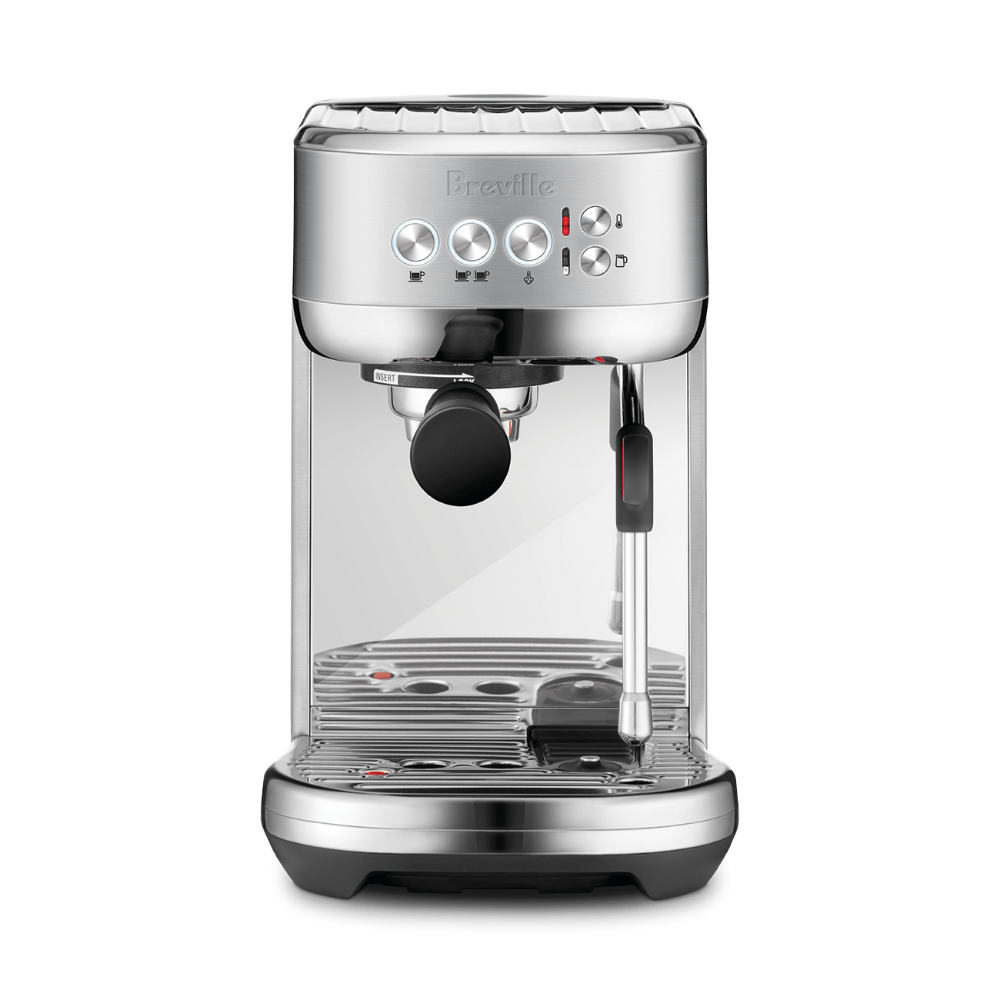

# [Breville Bambino Plus](https://www.breville.com/en-us/product/bes500)

> The outlier on this list. A $400-$500 thermoblock with automatic milk frothing, 3-second warmup, and a genuine pre-infusion. The best absolute-beginner machine money can buy, and the only machine here that does auto-milk.

## Where to buy

- [Whole Latte Love](https://www.wholelattelove.com/products/breville-bes500bss-bambino-plus)
- [Seattle Coffee Gear](https://www.seattlecoffeegear.com/)
- [Amazon](https://www.amazon.com/) — frequently the cheapest
- [Williams-Sonoma](https://www.williams-sonoma.com/) — for gift purchases
- [Best Buy](https://www.bestbuy.com/)

## Quick facts

| | |
|---|---|
| **Type** | Thermoblock (not traditional boiler), with thermocoil for steam |
| **MSRP** | $499 |
| **Street price (Apr 2026)** | $399 (Amazon) – $499 (Whole Latte Love, Williams-Sonoma) |
| **Dimensions (W×D×H)** | 7.7 × 12.6 × 12.2 in |
| **Weight** | 10.9 lb |
| **Warmup time** | **3 seconds** (ThermoJet) |
| **PID** | Yes, stock (proprietary temperature control) |
| **Flow/pressure control** | None |
| **Steam wand** | **Automatic** 4-hole with milk temperature probe; also has manual mode |
| **Portafilter** | **54mm** (not 58mm) |
| **Plumbable** | No |
| **Fits under 16" cabinet** | Yes (12.2 in H) |

## Specs

- **Heater:** Thermojet thermocoil (no boiler in the traditional sense)
- **Pump:** Vibratory, 15 bar factory (ramps to 9 bar for extraction)
- **Group:** Proprietary 54mm
- **Reservoir:** 64 fl oz / 1.9 L, top-fill
- **Wattage:** 1560 W
- **Voltage:** 110-120 V
- **Build:** Brushed stainless steel exterior, plastic drip tray and internals

## Key features

The Bambino Plus is the machine your grandparents could use. Three features make it unique on this list:

1. **3-second warmup** (ThermoJet) — no machine here comes close. From cold to shot is faster than a Keurig.
2. **Automatic milk steaming** — drop a temperature probe in the pitcher, choose a temperature and foam level on a dial, walk away. Produces decent latte-art-capable microfoam with zero technique.
3. **Programmable pre-infusion** — the Plus (unlike the base Bambino) has a genuine low-pressure ramp before full extraction.

What it's not: a prosumer machine with commercial parts. The internals are largely plastic, the boiler is a thermocoil (fast but thermally less stable than a real boiler), and the 54mm basket is smaller than the 58mm commercial standard. Longevity is also a known issue — Breville small appliances typically last 5-8 years rather than 20+.

## Steam and milk workflow

This is where the Bambino Plus shines. Auto-steam works: you get latte-art-quality microfoam for your first drink ever. Manual steam also works, and the 4-hole wand is capable. Steam pressure is surprisingly strong for the size — the thermojet architecture generates steam on demand rather than from a reservoir, so it doesn't "run out."

The catch: it can't do back-to-back drinks at café speed. The thermojet needs a few seconds between shot and steam to shift modes, and sustained multi-pitcher steaming isn't a strength. For one or two drinks in a row, it's genuinely excellent.

## Brew workflow and temperature stability

PID-controlled brew temperature is stable for one shot. The thermocoil design has less thermal mass than a boiler, so light-roast espresso at the edge of extraction is harder than on an HX or DB. Medium roasts land well.

Programmable pre-infusion is a real feature at this price — most $1,000+ machines don't have it unless they're E61. The Bambino Plus is specifically engineered to make beginners successful.

**54mm portafilter** means the accessory ecosystem is smaller, but Breville sells (or includes) most of what you need: single and double baskets, tamper, pressurized basket for beginners. Non-pressurized baskets are included and work well once you have a decent grinder.

## Grinder pairing

Your Eureka Mignon Specialita is overkill — the Bambino is balanced against grinders in the $200-$400 range (Baratza Encore ESP, DF54). With the Specialita feeding a Bambino, you'll get shots limited by the machine's thermal stability, not the grinder. You also can't use 58mm Specialita dosing tools directly; you'll need a 54mm dosing cup if you use one.

## Complexity and learning curve

The lowest on this list. A first-time espresso maker with a Bambino Plus and a decent grinder can make a good latte on day one using auto-steam. For an upgrading Mr. Coffee user, this is almost trivially easy.

Ceiling is also lower than most of this list — there's only so far you can push a thermoblock with a 54mm basket.

## Modification and upgrade potential

Limited. Breville designed the Bambino to be a closed appliance. Reasonable tinkers:

- **IMS nano shower screen** (~$40-60)
- **Non-pressurized double basket** (included or ~$20)
- **54mm naked/bottomless portafilter** (aftermarket, ~$50-100)
- **54-to-58mm adapter** (aftermarket, limited effectiveness)

No flow control, no pressure profiling, no open-source firmware. If you outgrow the Bambino, you sell it and buy something else.

## Pros and cons

**Pros**
- 3-second warmup (nothing else on this list is in the same universe)
- **Genuine auto-steaming** — only machine on this list with it; produces microfoam with zero technique
- Stock PID and pre-infusion at $400-500
- Compact (7.7 in wide), light (10.9 lb)
- Best absolute-beginner machine available
- Excellent Reddit sentiment (ranked #1 in several 2024-2025 polls)

**Cons**
- **54mm portafilter** — limits growth path into 58mm accessories
- Thermoblock vs real boiler — lower thermal mass, harder on light roasts
- Breville small appliance lifespan (~5-8 years typical)
- Plastic internals, limited repairability
- Ceiling is real — you can learn to make espresso, but to push further you'll need to upgrade

## Key reviews and references

- [Lance Hedrick — "Bambino Plus Review: How Good Is It, Really?"](https://www.youtube.com/watch?v=U2TNEhrBU5Q) — generally positive but honest about the ceiling
- [Seattle Coffee Gear — Bambino Plus Crew Review](https://www.youtube.com/watch?v=WgdB85zNCCQ)
- [Tom's Guide — Readers' favorite espresso machine](https://www.tomsguide.com/home/coffee-makers/our-readers-favorite-espresso-machine-is-the-breville-bambino-plus-and-i-couldnt-agree-more)

## Notable forum threads

- [Home-Barista — Modded/Upgraded Breville Bambino experiences](https://www.home-barista.com/repairs/mod-upgraded-breville-bambino-experience-t76292.html)
- [Reddit r/espresso — repeated year-end polls](https://www.reddit.com/r/espresso/) — Bambino Plus consistently tops beginner machine recommendations

## Who it's for

A first-time espresso buyer who wants results on day one, values ease of use and small footprint, and isn't committed to long-term espresso hobbyism. Also: someone who wants auto-steaming for the milk drinker in the household who doesn't want to learn technique.

**Not** for you: this use case is even-split milk/espresso upgrading from Mr. Coffee with a Specialita grinder. The Specialita implies commitment. The Bambino Plus would be a step up in result but a step sideways in workflow — still a single-boiler-style serial experience. Your $3,000 budget makes this the wrong buy.

Include it on this wiki as the reference point for "the easy path" — and because it might be the right machine for a second household member with different priorities.
