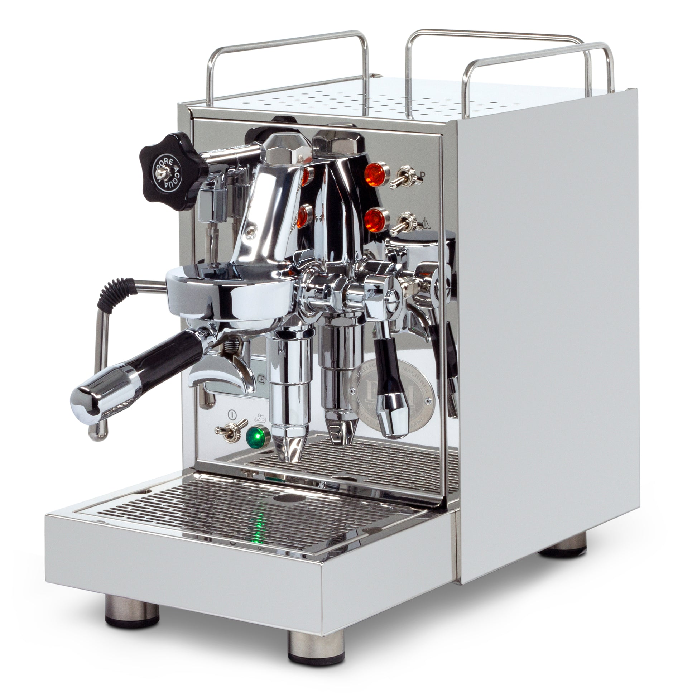

# [ECM Classika PID](https://www.ecm.de/produkte/classika-pid/)

> German engineering, Italian assembly, E61 group, Gicar PID — all in a compact single-boiler chassis. Best-in-class espresso experience for users who don't need simultaneous brew+steam.

## Classification note

The Classika PID is commonly grouped with HX machines because it shares the E61 group head, pressure gauge, and prosumer price bracket. Strictly speaking it's a **single-boiler E61** (0.75 L boiler) and does **not** offer simultaneous brew+steam — the boiler serves one function at a time. Everything else about the ownership experience — E61 pre-infusion, compatible flow control kits, mod ecosystem — is HX-class, which is why it lands in this section with a clarifying note.

If back-to-back milk drinks matter, step up to a true HX (Rocket Appartamento, Mara X, Profitec Pro 400) or any DB.

## Where to buy

- [Whole Latte Love](https://www.wholelattelove.com/products/ecm-classika-pid)
- [Clive Coffee](https://clivecoffee.com/products/special-edition-ecm-classika-pid-espresso-machine)
- [iDrinkCoffee](https://idrinkcoffee.com/products/ecm-classika-pid-espresso-machine) — Canadian retailer

## Quick facts

| | |
|---|---|
| **Type** | Single boiler with E61 group |
| **MSRP** | $1,799 (standard), $1,899 (w/ flow control kit) |
| **Street price (Apr 2026)** | $1,699-$1,799 (Whole Latte Love, Clive) |
| **Dimensions (W×D×H)** | 9.8 × 17.8 × 15.8 in |
| **Weight** | 45.6 lb |
| **Warmup time** | 11-15 min with Fast Heat Up |
| **PID** | **Yes** — Gicar, 1 °C increments |
| **Flow/pressure control** | **Available factory or aftermarket** — Profitec/ECM flow control kit with pressure gauge |
| **Steam wand** | 2-hole ball joint, no-burn |
| **Portafilter** | 58mm |
| **Plumbable** | Yes |
| **Fits under 16" cabinet** | Borderline (15.8 in) — measure carefully |

## Specs

- **Boiler:** 0.75 L stainless steel
- **Pump:** Vibratory, 15 bar max
- **Group:** E61 with mechanical pre-infusion chamber
- **Reservoir:** 2.8 L
- **Wattage:** 1200 W
- **Voltage:** 120 V confirmed
- **Build:** German-engineered, Italian-assembled; stainless steel throughout; copper and braided stainless plumbing

## Key features

- **Gicar PID with 1 °C increments** — the finest brew-temperature granularity at this price. Adjustable in real time via digital display.
- **E61 group with mechanical pre-infusion**
- **Factory flow control option** — the Classika is one of few machines where you can buy it with flow control pre-installed. Retrofit is straightforward if you upgrade later.
- **Fast Heat Up** mode — controlled overheat with guided flush, cuts warmup meaningfully.
- **No-burn ball-joint wand** — ergonomic.
- **Plumbable**.

What it lacks: simultaneous brew+steam. The 0.75 L boiler heats to either brew (~93 °C) or steam (~130 °C) temp, not both. In practice this means the Classika is an espresso-first machine that can handle occasional milk drinks rather than a dedicated milk-drink machine.

## Steam and milk workflow

The single 0.75 L boiler cycles to steam mode after your shot. Steam pressure is adequate for a single 8-10 oz drink; the recovery between brew and steam mode is ~30-45 seconds. Not a café workflow; adequate for solo users.

The 2-hole no-burn wand is pleasant; milk texturing is on par with prosumer HX wands. Ball joint provides good articulation.

## Brew workflow and temperature stability

This is where the Classika earns its price. The Gicar PID plus E61 thermosiphon gives shot-to-shot variance under ±1 °C — genuinely dual-boiler-competitive for brewing specifically. Light-roast espresso responds well because you can target 95-96 °C precisely.

With the flow control kit, you also gain tactile pre-infusion shaping (long low-flow rises) and a brew pressure gauge for real-time puck feedback. This turns the Classika into a serious single-group workflow machine.

## Grinder pairing

Specialita is ideal. The Classika is a workflow-focused espresso machine; grinder quality shows up directly. For light-roast profiling enthusiasts, consider a Niche Zero or DF64 gen 2 later, but the Specialita doesn't bottleneck anything here.

## Complexity and learning curve

Moderate. Single-boiler cycle between brew and steam is the main friction for milk drinkers. Espresso dial-in is easy thanks to PID + pressure gauge (if flow control kit is installed). The flow control paddle, if purchased, has its own learning curve but produces better light-roast shots.

## Modification and upgrade potential

Strong ecosystem:

- **Flow control kit** (factory or aftermarket, ~$150-200) — the Classika is specifically designed to accept ECM's E61 flow control kit
- **Steam tip swaps** — ECM and third-party tips
- **Brew pressure adjustment** — top-accessible
- **PID firmware tuning** via Gicar support

The Classika shares many parts with the ECM Mechanika and Synchronika lines, so service and replacement part availability is excellent.

## Pros and cons

**Pros**
- **Gicar PID with 1 °C increments** — best brew temperature precision in the sub-$2000 E61 market
- E61 group with mechanical pre-infusion
- Factory or aftermarket flow control kit available
- German engineering, Italian assembly, 3-year warranty
- Compact footprint (9.8 in wide); fits tight counters
- Reasonably fast warmup with Fast Heat Up mode

**Cons**
- **Not a true HX** — no simultaneous brew+steam, mode cycling required
- 0.75 L boiler means slow steam recovery; not for back-to-back milk
- 15.8 in height is borderline under 16" cabinets
- Flow control kit adds $100-200 if you want it
- At $1,699, the Lelit Mara X (true HX with simultaneous brew+steam) is a better workflow at the same price for most buyers

## Key reviews and references

- [Whole Latte Love — ECM Classika PID review](https://www.wholelattelove.com/blogs/reviews/ecm-classika-pid-espresso-machine-review)
- [Coffeedant — Classika PID + flow control review](https://coffeedant.com/espresso-machine/ecm-classika-pid-flow-control/)
- [Homegrounds — ECM Classika PID review](https://www.homegrounds.co/ecm-classika-pid-review/)

## Notable forum threads

- [Home-Barista — ECM Classika PID "my type of review"](https://www.home-barista.com/espresso-machines/ecm-classika-pid-type-review-t35473.html)
- [Home-Barista — Bezzera Unica or ECM Classika PID](https://www.home-barista.com/advice/which-to-buy-bezzera-unica-or-ecm-classika-pid-t90752.html)

## Who it's for

Espresso-first drinkers who value precise PID temperature control, E61 workflow, and long-term build quality more than simultaneous brew+steam. The Classika with flow control kit is arguably the best single-boiler-format espresso workflow available at any price — if you're making 1-2 drinks per session and don't need café speed.

**Not** for you if milk drinks are a major part of your daily routine. For an even milk/espresso user, the Mara X at the same price handles the same espresso needs and adds simultaneous steaming — a material upgrade.
