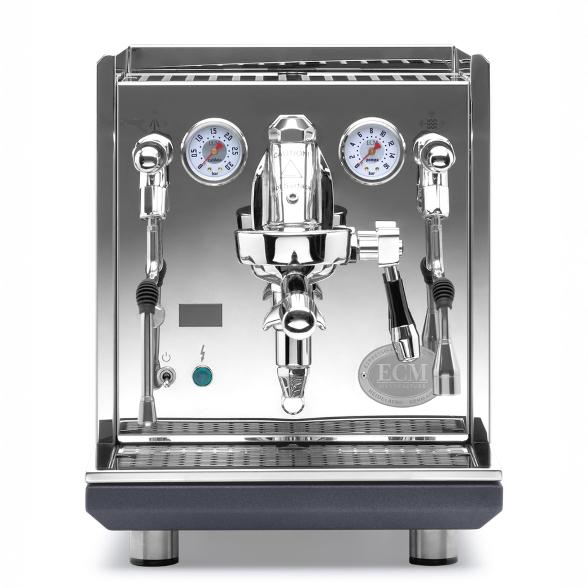

# [ECM Synchronika (II)](https://www.ecm.de/en/products/synchronika-ii/)

> The German flagship E61 dual boiler, now in its Synchronika II revision with cartridge-heater fast warmup. Build quality ceiling for traditional E61 DBs. At $3,600, competes directly with the Lelit Bianca (which adds paddle flow control at $600 less).

## Where to buy

- [Whole Latte Love](https://www.wholelattelove.com/products/ecm-synchronika-ii)
- [Clive Coffee](https://clivecoffee.com/products/ecm-synchronika-ii-espresso-machine)
- [Home Coffee Solutions](https://www.homecoffeesolutions.com/collections/ecm-synchronika-espresso-machines)

## Quick facts

| | |
|---|---|
| **Type** | Dual boiler, E61, rotary pump |
| **MSRP** | $3,599 |
| **Street price (Apr 2026)** | $3,599 (Whole Latte Love, Clive, Home Coffee Solutions) |
| **Dimensions (W×D×H)** | ~13.8 × 18.3 × 16.3 in (height tight under 16" cabinet) |
| **Weight** | ~55 lb |
| **Warmup time** | **6.5 min** (Synchronika II with cartridge-heater group) |
| **PID** | **Yes** — dual independent PID, OLED display |
| **Flow/pressure control** | None stock; aftermarket paddle kits available |
| **Steam wand** | Commercial 2-bar steam pressure, 2-hole tip |
| **Portafilter** | 58mm |
| **Plumbable** | **Yes** (rotary pump, factory plumb kit) |
| **Fits under 16" cabinet** | Borderline (~16.3 in) — measure carefully |

## Specs

- **Brew boiler:** 0.75 L stainless steel with cartridge heaters in group (Synchronika II)
- **Steam boiler:** 2.0 L stainless steel (the largest steam boiler on this list)
- **Pump:** **Rotary** — plumbable, quiet
- **Group:** E61 with integrated cartridge heaters (Synchronika II redesign)
- **Reservoir:** 3.0 L with low-water sensor, BPA-free
- **Voltage:** 110 V and 220 V variants; confirm US 110 V at purchase
- **Build:** German-engineered; commercial-grade internal plumbing; all-stainless throughout

## Key features

The Synchronika II (released 2022-2023, now standard production) introduced **cartridge heaters directly in the E61 group**, dramatically shortening warmup to ~6.5 min from the ~25 min of the original Synchronika. This is one of the fastest real warmups of any prosumer E61 machine.

Other highlights:

- **OLED PID display with rotary control knob** — menu-driven, elegant, easy-to-read
- **Dual independent PID** for brew and steam
- **Programmable pre-infusion** (active and passive modes)
- **2 L steam boiler with 2-bar steam pressure** — commercial-class steaming, handles large pitchers and back-to-back drinks
- **Rotary pump, plumbable** — quiet operation, optional direct-connect
- **3 L reservoir with low-water sensor** — protects boilers from dry running
- **Electronic shot timer**
- **Dual gauges** (brew + steam pressure)
- **3-year warranty**

What it lacks: stock flow control. The Synchronika is often paired with aftermarket paddle flow control kits; some retailers offer them pre-installed. The Bianca at $3,000 has paddle flow control factory standard.

## Steam and milk workflow

The 2 L steam boiler is the defining feature. Steam power is commercial-class — silky microfoam fast, no recovery issues even for multiple pitchers. If you make milk drinks for a household or entertain, the Synchronika's steaming is unmatched at this price.

The 2-hole tip is stock; 4-hole and 6-hole upgrades are straightforward.

## Brew workflow and temperature stability

Dual PID on brew and steam, E61 with cartridge heaters. Shot-to-shot variance is ±0.5 °C or better. Fast warmup (6.5 min) is a huge daily-use improvement over standard E61 DBs.

No stock flow control paddle. Mechanical E61 pre-infusion is excellent, and the programmable electronic pre-infusion adds another layer. For most workflows, you don't miss the paddle — but if you want shot-profile control, the Bianca is the direct peer and includes it.

## Grinder pairing

Specialita is fine. At this price tier, many owners upgrade to single-dose grinders (Niche Zero, DF64 gen 2, Specialita XL), but this is discretionary. The Synchronika doesn't demand a grinder upgrade.

## Complexity and learning curve

Low. Fast warmup, stable brew, plenty of steam — the Synchronika is arguably the easiest-to-live-with DB on this list because nothing is fiddly. The OLED menu is intuitive. Plumbed-in, the daily experience is: flip power on, wait 6.5 min, make drinks.

## Modification and upgrade potential

Moderate. The German engineering discourages heavy tinkering; most owners leave the Synchronika stock:

- **Aftermarket flow control paddle** (Profitec FCD kit is not a direct fit; ECM-specific and universal kits exist, $200-400)
- **Steam tip swaps**
- **Rotary pump swap** — already rotary, no upgrade path
- **Cosmetic panels** (walnut, colored accents)

The Synchronika is a "buy it nice once" machine, not a platform for modification.

## Pros and cons

**Pros**
- **Fastest warmup of any traditional E61 DB (~6.5 min)** — Synchronika II cartridge heaters
- **2 L steam boiler** — commercial-grade steam power, handles heavy milk routines
- Rotary pump, plumbable — quiet operation, end of tank refills
- Dual PID with OLED display, programmable pre-infusion
- German engineering, 3-year warranty, 10+ year lifespan
- Polished stainless finish, high-end aesthetic

**Cons**
- **$3,599** — the Bianca at $3,000 adds paddle flow control and saves $600; hard to justify Synchronika on features alone
- No stock flow control
- 16.3 in height is borderline under 16" cabinets
- No programmable volumetrics
- Positioned against Profitec Pro 700 at similar price — Pro 700 has factory flow control and rotary pump at ~$3,600-3,800; the differentiation is subtle
- At this price, the Decent DE1Pro ($3,700) offers software profiling — different category but an alternative

## Key reviews and references

- [Home-Barista — Synchronika experienced user review](https://www.home-barista.com/espresso-machines/new-ecm-synchronika-experienced-user-review-t77935.html) — detailed long-term impressions from a former commercial machine owner
- [HomeGrounds — ECM Synchronika review](https://www.homegrounds.co/ecm-synchronika-review/) — build quality, dual PID, comparison to peers
- [Clive Coffee — Synchronika II overview](https://clivecoffee.com/blogs/learn/ecm-synchronika-ii-espresso-machine-overview) — Synchronika II cartridge heater redesign explained

## Notable forum threads

- [Home-Barista — Synchronika vs Rocket R58 vs Profitec Pro 700 vs Linea Mini](https://www.home-barista.com/advice/ecm-synchronika-vs-rocket-r58-vs-profitec-pro-700-vs-linea-mini-t44512.html) — canonical "top-tier prosumer" comparison thread
- [CoffeeSnobs — R58 vs Pro 700 vs Synchronika](https://coffeesnobs.com.au/forum/equipment/brewing-equipment-extreme-machines-3000/46728-rocket-r58-vs-profitec-700-vs-ecm-synchronika)

## Who it's for

The buyer who wants the best-built traditional E61 dual boiler and doesn't need paddle flow control. Also: anyone who makes a lot of milk drinks — the 2 L steam boiler is unmatched at this price. Someone planning to plumb in benefits from the factory plumb kit compatibility.

**Not** for you if flow control is important (go Bianca at $3,000 — identical category, $600 cheaper, paddle included). Not for you if you want software profiling (go Decent). Not for you on a tight budget — the Elizabeth covers the DB essentials at half the price.

For an even milk/espresso user with $3,600 budget: the Synchronika is the "I want the best-built traditional DB and will forgo flow control" pick. If you prefer the paddle workflow, spend less and buy the Bianca.
