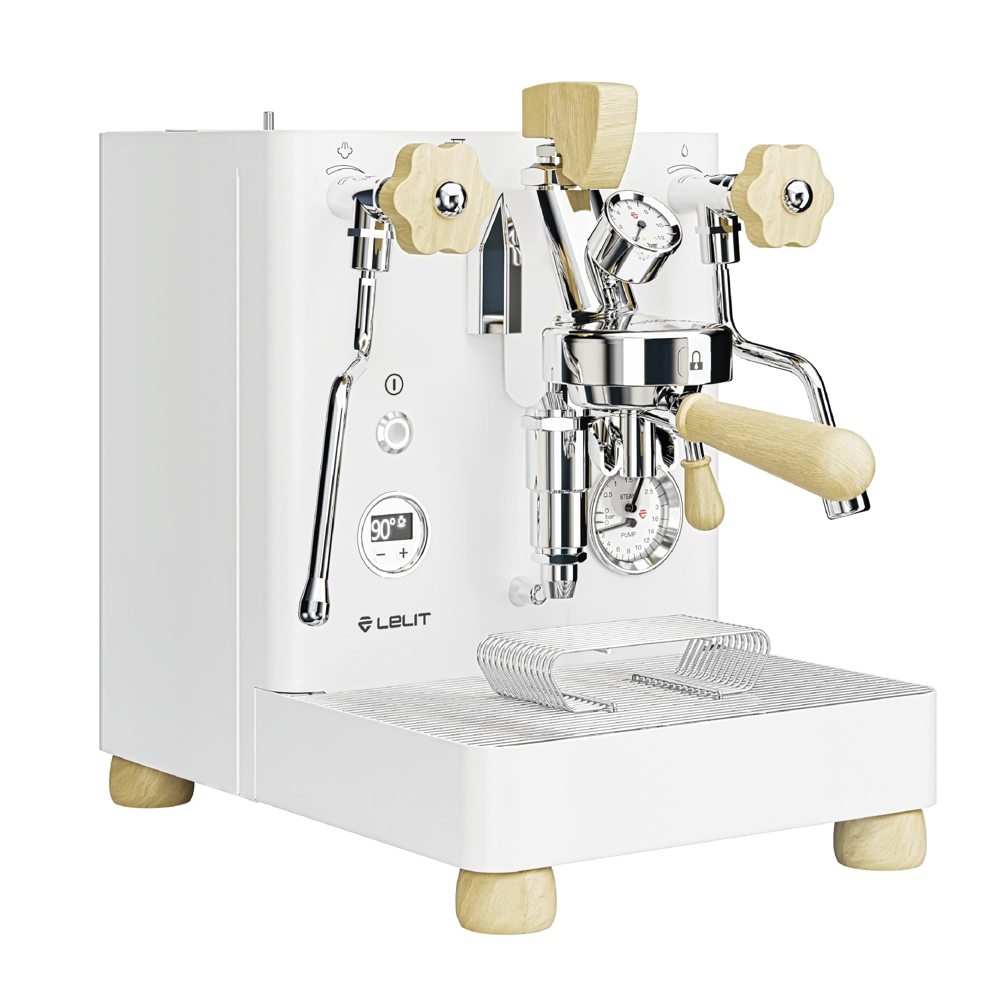

# Lelit Bianca (V3)

> The flow control canon. An E61 dual boiler with a paddle-controlled needle valve in the group head, the most accessible "pressure/flow profiling" experience money can buy, at $3,000. V3 (2024-2026) adds programmable electronic low-flow modes and refreshed finishes.

## Where to buy

- [Clive Coffee](https://clivecoffee.com/products/lelit-bianca-dual-boiler-espresso-machine) — often sold out but standard retailer
- [Whole Latte Love](https://www.wholelattelove.com/products/lelit-bianca-v3-dual-boiler-espresso-machine)
- [Chris' Coffee](https://www.chriscoffee.com/products/lelit-bianca-dual-boiler-espresso-machine)

## Quick facts

| | |
|---|---|
| **Type** | Dual boiler, E61, with paddle flow control |
| **MSRP** | $2,999.95 |
| **Street price (Apr 2026)** | $2,999-$3,099 (Clive — often sold out; Whole Latte Love, Chris' Coffee) |
| **Dimensions (W×D×H)** | 11.4 × 19.1 × 15.75 in |
| **Weight** | 58.5 lb |
| **Warmup time** | ~10-12 min (improved in V3) |
| **PID** | **Yes** — dual independent PID, per-degree (±1 °C) |
| **Flow/pressure control** | **Yes, stock** — mechanical paddle (needle valve in group); V3 adds programmable electronic low-flow modes |
| **Steam wand** | Articulating, 2-hole tip (V3 updated knobs) |
| **Portafilter** | 58mm |
| **Plumbable** | **Yes** — modular reservoir, can be direct-plumbed |
| **Fits under 16" cabinet** | Yes (15.75 in) |

## Specs

- **Brew boiler:** 0.8 L stainless steel, 1000 W heating element
- **Steam boiler:** 1.5 L stainless steel, 1400 W heating element
- **Pump:** **Rotary** (plumbable)
- **Group:** E61 with integrated needle valve for paddle flow control
- **Reservoir:** 2.5 L BPA-free, **modular** (left/right/back mounting)
- **Wattage:** 2400 W total
- **Voltage:** 110 V and 220 V confirmed
- **Build:** Stainless steel with walnut wood accents (V3 also in Stone Grey and Deep Walnut)

## Key features

The Bianca's signature feature is the **paddle flow control**: a lever on the group head that physically controls a needle valve in the brew water path. Move the paddle during the shot and you adjust water flow in real time, which shapes pressure at the puck.

Practical shot profile with paddle:

1. Start with paddle low (slow flow) — long pre-infusion, puck wets evenly
2. Ramp paddle up — brew pressure rises toward 9 bar
3. At the end of shot, drop paddle back for a declining taper

This is a real lever for light-roast espresso and for dialing in difficult coffees. It's also legitimately fun to use.

V3 additions (2024 onward):

- **Programmable electronic low-flow mode** — LCC-configurable pre-infusion that automates paddle movements at shot start; approximates a Slayer-style opening without manual input
- **Updated knob tactile feedback** on steam controls
- **New finishes**: Stone Grey, Deep Walnut (beyond the original walnut)
- **Faster warmup** (PID algorithm improvements)
- **Improved pump damping**

Other standard features:

- Three pressure gauges (group, pump, steam boiler)
- Rotary pump, plumbable
- Modular 2.5 L reservoir (reposition or remove for plumb)
- 4 power modes (Always On, Sleep 40-540 min, Eco [steam off], Standby [30 min auto-off])
- Temperature offset function (±25 °C)
- Full LCC programmability (dozens of settings)

## Steam and milk workflow

1.5 L stainless steam boiler provides strong continuous steam. Not as large as the Synchronika's 2 L, but entirely adequate for home use. 2-hole tip stock; 4-hole upgrade available.

Simultaneous brew and steam, as expected.

## Brew workflow and temperature stability

Dual PID delivers ±0.5-1 °C variance. E61 thermal mass is excellent. The paddle flow control is the real workflow differentiator — once you've learned to drive it, shot profiles become intentional rather than "whatever the pump decides."

Learning curve: two to four weeks of experimentation to develop repeatable paddle movements. V3's electronic low-flow mode lets you get most of the benefit without manual paddle discipline, which is a real improvement for less-experienced users.

## Grinder pairing

Specialita is fine; Bianca owners often step up to single-dose grinders (Niche Zero, Niche Duo, Lagom P64, DF64 gen 2) to extract full value from flow profiling. Light-roast and profiling workflows reward grinder precision most.

With Specialita, the Bianca delivers excellent medium-roast espresso and opens the door to paddle experimentation. The grinder won't bottleneck you.

## Complexity and learning curve

Moderate. Stock DB workflow is easy. The paddle adds a new skill dimension — approachable via YouTube tutorials (Lance Hedrick's Bianca content is excellent), but requires deliberate practice.

V3's electronic low-flow mode reduces the paddle learning curve by ~60-70%: set the low-flow profile in LCC, pull shots normally, get most of the paddle benefit automatically.

## Modification and upgrade potential

Modest. Lelit engineered the Bianca as a flagship; minimal mods needed:

- **Steam tip swap** (4-hole for faster milk)
- **Alternative wood accent panels** (V3 finishes reduce need for cosmetic mods)
- **LCC tuning** (deep programmability out of the box)
- **Plumbing conversion** (modular reservoir)

No paddle-to-paddle aftermarket; the stock paddle is the standard. Profile sharing is less developed than on the Decent.

## Pros and cons

**Pros**
- **Only factory paddle flow control machine on this list under $4,000** — genuine pressure/flow profiling via mechanical paddle
- V3 programmable electronic low-flow mode — automated profiles without paddle discipline
- Dual PID, E61 group, rotary pump, plumbable — full feature set
- Three pressure gauges (most on this list)
- 1.5 L steam boiler, strong milk performance
- $600 cheaper than Synchronika with meaningfully more feature set
- V3 polished — mature product, 2026 production

**Cons**
- **19.1 in depth** — one of the longer machines on this list; counter depth matters
- Paddle learning curve is real (V3 low-flow helps but doesn't eliminate)
- 1.5 L steam boiler smaller than Synchronika's 2 L (fine for home, not café)
- LCC menu navigation has its own learning curve
- V3 electronic low-flow mode is still maturing in community feedback
- No pressure profiling chart/logging (that's Decent territory)

## Key reviews and references

- [Lance Hedrick — Lelit Bianca V3 review (YouTube)](https://www.youtube.com/watch?v=A7yGmZe57U8) — extensive deep-dive from a 2x World Barista Championship runner-up coach
- [Seattle Coffee Gear — Bianca crew review](https://www.seattlecoffeegear.com/blogs/scg-blog/crew-review-lelit-bianca)
- [CoffeeKev — Bianca V3 review (2026)](https://coffeekev.com/lelit-bianca-v3-review/)

## Notable forum threads

- [Home-Barista — Bianca V3 wordy impressions after 2 months](https://www.home-barista.com/espresso-machines/lelit-bianca-v3-wordy-impressions-after-2-months-use-t82672.html) — detailed ownership notes, cup quality, paddle learning curve
- [Home-Barista — Meaningful upgrade from Lelit Bianca V3](https://www.home-barista.com/advice/meaningful-upgrade-from-lelit-bianca-v3-t92868.html) — community debating what's left to upgrade to

## Who it's for

The flow profiling curious buyer who wants a mechanical, tactile, repairable implementation of pressure control. Also: someone who wants the premium DB experience (rotary pump, plumbable, dual PID, E61) without paying Synchronika-level premiums.

For light-roast drinkers and experimenters, the Bianca is probably the best value on this list. The paddle is a real lever; V3's electronic low-flow mode reduces the learning curve.

**Not** for you if you just want to make espresso and don't want another variable to manage (go Synchronika or Elizabeth). Not for you if you want software-defined profiling with data logging (go Decent).

For an even milk/espresso user with $3,000 budget: **the best single pick at this price if you're curious about flow control**. If you're not, the Synchronika is a more "buy-and-forget" experience, or the Elizabeth at $1,200 less covers 85% of the non-paddle workflow.
