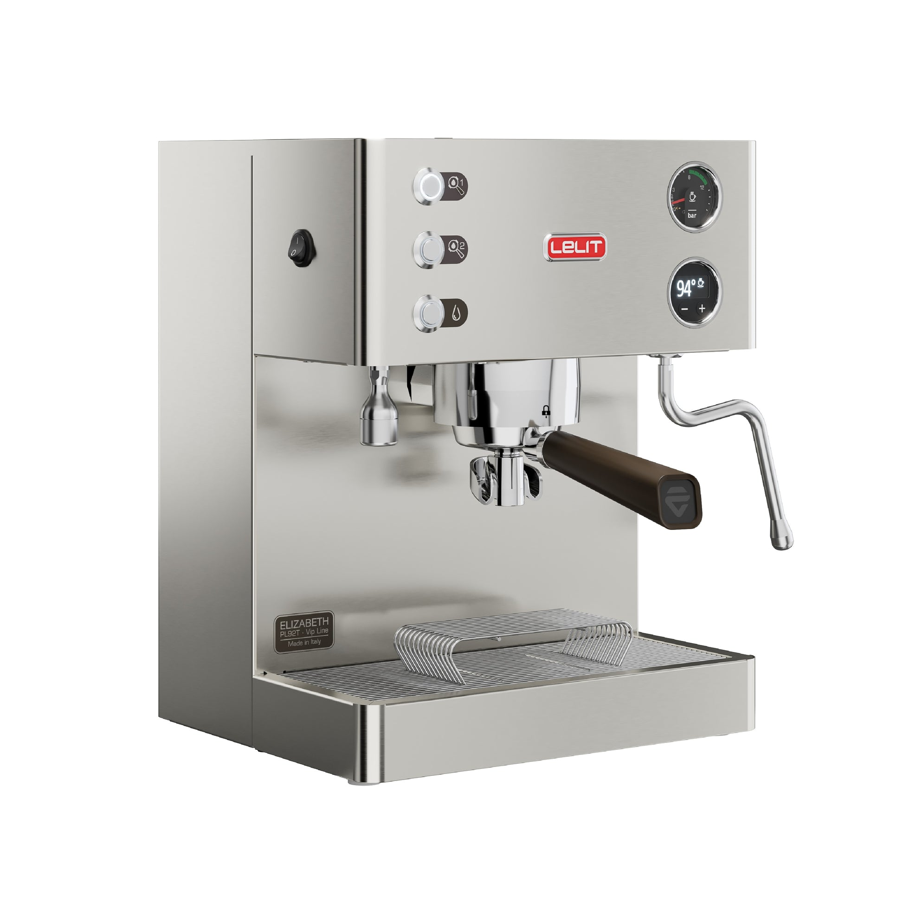

# [Lelit Elizabeth (PL92T V3)](https://www.lelit.com/en-us/product/elizabeth-pesel01)

> The value DB champion. A saturated-group dual boiler with programmable pre-infusion, three shot buttons, and dual PID, at $1,800. The V3 (2024-2026) adds a quieter pump and makes this the default "first real DB" recommendation.

## Where to buy

- [Clive Coffee](https://clivecoffee.com/products/lelit-elizabeth-dual-boiler-espresso-machine)
- [Whole Latte Love](https://www.wholelattelove.com/products/lelit-elizabeth-espresso-machine)
- [My Espresso Shop — PL92T V3](https://www.myespressoshop.com/products/lelit-pl92t-elizabeth-v2-double-boiler-espresso-machine)
- [Consiglio's Kitchenware](https://www.consiglioskitchenware.com/products/lelit-elizabeth)

## Quick facts

| | |
|---|---|
| **Type** | Dual boiler with saturated group |
| **MSRP** | $1,800 |
| **Street price (Apr 2026)** | $1,799-$1,899 (Clive, Whole Latte Love, Chris' Coffee) |
| **Dimensions (W×D×H)** | 12.0 × 11.0 × 15.0 in |
| **Weight** | **27 lb** (lightest DB on this list) |
| **Warmup time** | ~15 min |
| **PID** | **Yes** — dual PID, per-degree, via Lelit Control Center (LCC) |
| **Flow/pressure control** | **Programmable electronic pre-infusion** (via LCC); no paddle flow control |
| **Steam wand** | Articulating, single-hole (designed for microfoam) |
| **Portafilter** | 58mm |
| **Plumbable** | No |
| **Fits under 16" cabinet** | Yes (15 in) |

## Specs

- **Brew boiler:** 0.3 L brass, saturated group (LELIT58)
- **Steam boiler:** 0.6 L stainless steel
- **Pump:** Vibratory (quieter-tuned in V3)
- **Group:** Saturated LELIT58 (electronically controlled solenoid)
- **Reservoir:** 2.5 L BPA-free, removable and repositionable (left/right/back)
- **Wattage:** ~900 W (low power draw for a DB)
- **Voltage:** 110-120 V confirmed
- **Build:** Stainless steel body, brass brewing circuit, Italian-assembled

## Key features

The Elizabeth is Lelit's feature-per-dollar champion and has been since launch. The V3 (current production 2024-2026) adds a quieter pump and better finish options. What you get:

- **Lelit Control Center (LCC)** — Lelit's menu-driven configuration system; exposes dozens of settings (brew temp, steam temp, pre-infusion time and pressure, energy-save modes, shot timer options, programmable volumetrics)
- **Three programmable shot buttons** — volumetrics by time or pulse count
- **Saturated brew group** — excellent thermal stability
- **Programmable electronic pre-infusion** — tune time and pressure via LCC
- **Dual pressure gauges** — brew and steam visible
- **Low power draw** (~900 W) — cheapest DB to leave running all day

What it lacks vs Bianca/Synchronika: paddle flow control, E61 group, full-size steam boiler. The Elizabeth is smaller and cheaper and leans into that.

## Steam and milk workflow

The single-hole wand is a deliberate choice — more technique-dependent than a 2-hole commercial, but capable of very high-quality microfoam once learned. Some reviewers mark the single-hole down; others prefer it for small pitchers and latte art precision. An aftermarket 2-hole tip swap is a simple mod.

0.6 L steam boiler is the smallest on the DB list. Fine for 1-2 drinks per session; not for heavy café-style batches.

LCC allows steam temperature boost (up to 145 °C on the steam side) for owners wanting stronger steam — one of the most-tweaked LCC settings.

## Brew workflow and temperature stability

Saturated group + dual PID = best-in-class brew temperature stability. Lelit publishes ±0.5 °C variance; reviewers confirm in practice.

Programmable electronic pre-infusion via LCC is a real feature — set low-pressure ramp duration and target, and the machine executes consistently. Different from E61 mechanical pre-infusion (which is passive and pressure-driven), but effectively similar results.

No flow control paddle — if you want live pressure manipulation during the shot, step up to Bianca.

## Grinder pairing

Specialita is a perfect match. Lelit and Eureka are both Italian prosumer brands frequently paired in retailer bundles. The Specialita's stepless grind and burr design complement the Elizabeth's workflow speed.

## Complexity and learning curve

Low to moderate. The basic shot-pull workflow is as easy as any DB on this list. The LCC adds a learning curve only if you choose to engage with it — reading menus, adjusting settings, programming volumetrics. Most owners set it once and move on.

## Modification and upgrade potential

Small but real:

- **Steam tip swap** — 2-hole replacement for faster milk
- **Knob upgrades** — aftermarket wood/metal
- **LCC software tuning** — increase steam pressure, adjust pre-infusion, auto-shutoff timing
- **IMS shower screens and baskets**

No paddle flow control retrofit; the saturated group doesn't have the E61 cap architecture. Stay stock or step up to Bianca.

## Pros and cons

**Pros**
- **Best feature-per-dollar DB on this list** at $1,800
- Saturated brew group: commercial-grade thermal stability (±0.5 °C)
- Dual PID, programmable pre-infusion, three shot buttons
- LCC programmability: deep customization for power users
- Smallest footprint of any DB here (12 × 11 × 15 in, 27 lb)
- Low power draw (900 W) — cheapest to leave on
- Modular reservoir (repositionable, left/right/back)
- Strong Lelit community, Home-Barista threads, YouTube content

**Cons**
- **Single-hole steam wand** stock — technique-demanding vs 2-hole commercial
- Smallest boilers (0.3 + 0.6 L) — limits back-to-back milk
- Not E61 — smaller accessory ecosystem than Pro 600/Synchronika/Mara X
- No paddle flow control (Bianca territory)
- LCC menu-driven interface has a learning curve for power users
- Tank-only, not plumbable
- Vibratory pump (though V3 is quieter)

## Key reviews and references

- [Clive Coffee — Lelit Elizabeth overview](https://clivecoffee.com/blogs/learn/lelit-elizabeth-overview)
- [Coffeedant — Lelit Elizabeth review](https://coffeedant.com/espresso-machine/lelit-elizabeth/) — detailed 2026 perspective, LCC depth, value positioning
- [Home Grounds — PL92T review](https://www.homegrounds.co/lelit-elizabeth-review/)

## Notable forum threads

- [Home-Barista — Lelit Elizabeth owner experience](https://www.home-barista.com/espresso-machines/lelit-elizabeth-owner-experience-t58290.html) — long-running thread, LCC tuning, reliability
- [Home-Barista — Breville DB vs Lelit Elizabeth vs Lelit Bianca](https://www.home-barista.com/advice/breville-dual-boiler-lelit-elizabeth-lelit-bianca-or-something-else-t72589.html) — classic decision thread

## Who it's for

The default "first real DB" recommendation on this wiki for an even milk/espresso user at ~$1,800. The feature set (dual PID, programmable pre-infusion, shot buttons, saturated group, compact footprint) covers 85% of what a Bianca delivers at 60% of the price.

Also: someone who wants a DB in the smallest possible footprint — the Elizabeth is genuinely compact, making it the best DB for counter-constrained kitchens.

**Not** for you if you specifically want E61 group aesthetics/workflow (step to Pro 600), paddle flow control (Bianca), or a larger steam boiler for heavy milk routines (Pro 600 or Synchronika).

For this user's use case: **this is the top single recommendation if the budget sweet spot is ~$1,800-2,000.** Strong feature density, strong community, compact, and the V3 is a refined mature product.
