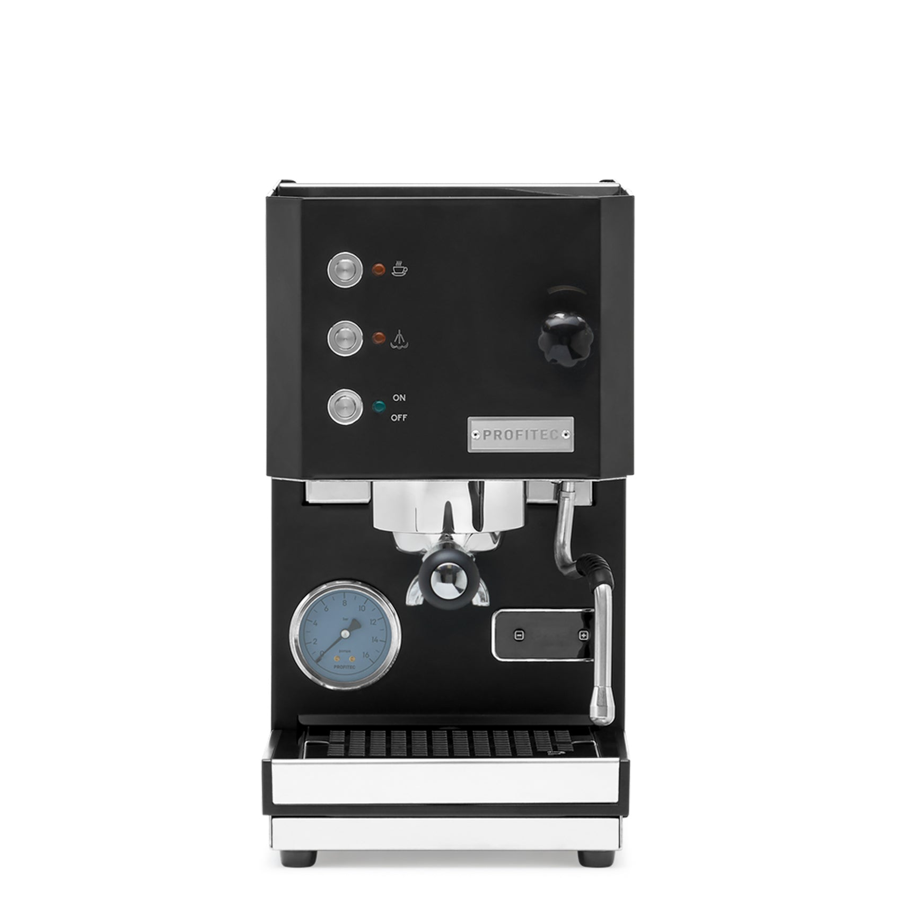

# [Profitec Go](https://www.profitec-espresso.com/en/products/go)

> A premium single boiler with rotary pump, PID, and polished-stainless build at $1,200. The single boiler with the best build quality on this list — and the hardest value proposition to justify against HX machines $300 away.

## Where to buy

- [Whole Latte Love](https://www.wholelattelove.com/products/profitec-go-espresso-machine)
- [Clive Coffee](https://clivecoffee.com/)
- [Seattle Coffee Gear](https://www.seattlecoffeegear.com/)

## Quick facts

| | |
|---|---|
| **Type** | Single boiler with PID |
| **MSRP** | $1,199 |
| **Street price (Apr 2026)** | $1,199 (Whole Latte Love, Clive) — rarely discounted |
| **Dimensions (W×D×H)** | 8.3 × 14.5 × 14.9 in |
| **Weight** | 28.6 lb |
| **Warmup time** | 5-6 min ready, 8.5 min full |
| **PID** | **Yes, stock** (integrated shot timer) |
| **Flow/pressure control** | OPV adjustable 8-12 bar |
| **Steam wand** | Commercial-style, rubber grip, 2-hole |
| **Portafilter** | 58mm |
| **Plumbable** | No |
| **Fits under 16" cabinet** | Yes (14.9 in) |

## Specs

- **Boiler:** Brass, ~0.4 L
- **Pump:** **Rotary** (unique at this price — quiet, commercial-grade)
- **Group:** Proprietary "ring" brew group with pre-infusion chamber
- **Reservoir:** 2.8 L
- **Wattage:** 900 W (110V US)
- **Voltage:** 110V US confirmed
- **Build:** Polished stainless steel, plastic drip tray

## Key features

The Go is the newest member of the German-engineered Profitec line (designed in Germany, assembled in Italy). The headline feature — unusual at this price — is the **rotary pump**. Near-silent operation compared to the vibratory-pump competition; the kind of quiet that makes the machine pleasant to live with. Most machines with rotary pumps cost $2,500+; the Go brings this down to $1,200.

Other stock features:
- **Front-panel PID** with shot timer, brew temperature adjustable by degree
- **Eco mode and Fast Heat Up** (the former reduces idle draw, the latter accelerates warmup)
- **User-adjustable OPV** accessible from the top panel (8-12 bar range)

What it doesn't have: pre-infusion by E61 mechanical design (it's not an E61 machine), simultaneous brew+steam, or large thermal mass for milk drinks. The group is a proprietary ring design — some reviewers note a "pressure profiling hack" using the steam wand valve to bleed pressure, which is cute but not a serious flow control implementation.

## Steam and milk workflow

Classic single-boiler flip: pull shot, flip steam switch, wait ~30 seconds, steam milk, cycle back or flush to brew temp. Steam pressure is adequate for one 10-12 oz drink; the ~0.4 L boiler is bigger than the Anna's but still a single-drink affair.

The 2-hole commercial wand on rubber grip is a small but real upgrade over the Silvia/Anna 1-hole wands — faster steam, less technique-dependent.

## Brew workflow and temperature stability

PID-controlled, stable, quiet. The rotary pump means you can actually hear the shot extracting instead of the pump. Shot-to-shot variance around ±0.5 °C. No temperature surfing.

**No E61 mechanical pre-infusion** is the notable gap. The proprietary brew group has a small pre-infusion chamber that provides a brief soak, but it's not comparable to the 3-4 second ramp of an E61 machine. Some reviewers mark this down; for medium-roast espresso it's a non-issue, for light roasts it matters.

## Grinder pairing

Specialita is well-matched. The Go is most at home with a single-dose workflow (morning espresso, maybe a latte), which is the Specialita's strength. No modifications to the grinder needed.

## Complexity and learning curve

Low. PID + shot timer + accessible OPV + rotary pump = easy to dial in and forgiving day-to-day. The lack of pre-infusion means light roasts require more attention than on an E61, but medium roasts are straightforward.

## Modification and upgrade potential

Small. The Go is a mature, well-spec'd machine out of the box. Common tinkers:

- **OPV adjustment** (built-in, no parts)
- **Bottomless portafilter** (58mm standard, ~$40-80)
- **Steam wand tip upgrade** (limited availability — proprietary-ish attachment)

No flow control kits, no open-source alternatives. This is an appliance, not a project.

## Pros and cons

**Pros**
- Rotary pump at $1,200 — genuinely unusual and a big quality-of-life win
- Stock PID with shot timer, polished stainless build
- Fast warmup (5-6 min) for an all-metal machine
- 3-year warranty from Profitec
- 58mm portafilter, full ecosystem access
- Small footprint (8.3 in wide)

**Cons**
- **$1,200 single boiler** competes with $1,400-$1,700 HX machines — the workflow limitation is the value objection
- No mechanical E61 pre-infusion
- Proprietary brew group limits accessory swaps
- Small boiler, modest steam; not for back-to-back milk
- The Lelit Mara X is $500 more and a full HX with PID and simultaneous brew+steam

## Key reviews and references

- [Seattle Coffee Gear — Profitec Go video review](https://www.youtube.com/watch?v=KqRmShH3HJE)
- [Whole Latte Love — Profitec Go blog review](https://www.wholelattelove.com/blogs/reviews/profitec-go-review)
- [Coffeedant — compact PID single boiler analysis](https://coffeedant.com/espresso-machine/profitec-go/)

## Notable forum threads

- [Home-Barista — "Profitec GO owners - show yourselves"](https://www.home-barista.com/advice/profitec-go-owners-show-yourselves-t94478-20.html) — common framing: "the machine Silvia should have evolved into"
- [Coffee Forums — Go vs Pro 500 vs Silvia Pro X](https://www.coffeeforums.co.uk/threads/profitec-go-vs-pro-500-vs-silvia-pro-x.71362.html)

## Who it's for

Someone who wants the quietest, best-built single boiler money can buy, values polished stainless and rotary pump over the full feature set of an HX, and does mostly solo espresso with occasional milk. Also: someone with strict space constraints (the 8.3-inch width is the narrowest of any prosumer here) who really doesn't want to step up to HX/DB footprint.

**Not** for you if you value simultaneous brew+steam, mechanical pre-infusion, or back-to-back milk drinks. For an even-split milk/espresso user, the Go's workflow is not meaningfully different from the Anna at 40% the price, and the HX tier (Mara X, Appartamento) is a better destination for the budget.
