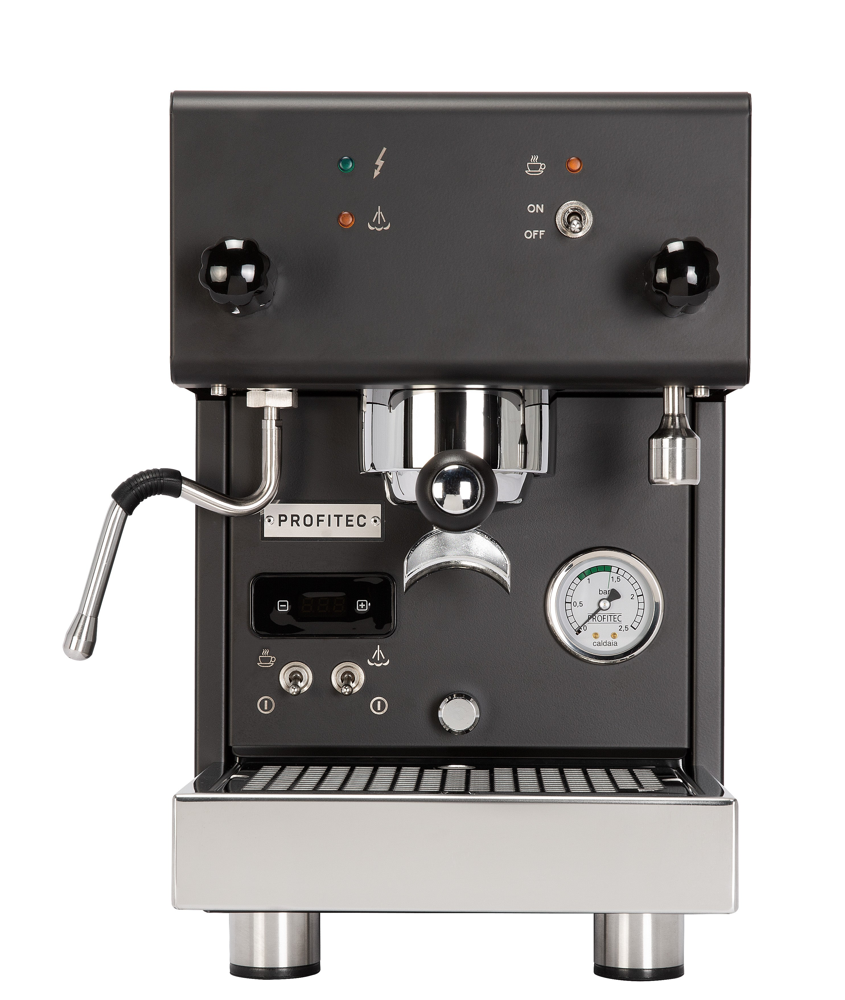

# Profitec Pro 300

> Compact dual boiler with saturated group and fast warmup. The "small-footprint serious DB" pick. Being phased out in favor of the Profitec Move in 2025-2026; inventory is limited.

## Where to buy

- [Whole Latte Love](https://www.wholelattelove.com/products/profitec-pro-300-dual-boiler-espresso-machine)
- [Clive Coffee — now carries Profitec Move](https://clivecoffee.com/) — may still stock Pro 300
- [eBay](https://www.ebay.com/) — used and reseller listings for Pro 300 specifically

## Quick facts

| | |
|---|---|
| **Type** | Dual boiler with saturated group |
| **MSRP** | ~$1,929 |
| **Street price (Apr 2026)** | $1,799-$1,929 (Whole Latte Love; Clive often sold out as Move takes over) |
| **Dimensions (W×D×H)** | 10.0 × 16.3 × 15.2 in |
| **Weight** | 39.7 lb |
| **Warmup time** | 8.5-10 min (Fast Heat Up mode), ~20 min full |
| **PID** | **Yes** — Gicar, per-degree |
| **Flow/pressure control** | Aftermarket flow control kit available |
| **Steam wand** | Articulating, 2-hole, no-burn |
| **Portafilter** | 58mm |
| **Plumbable** | No |
| **Fits under 16" cabinet** | Yes |

## Availability note

Profitec launched the **Profitec Move** (2024) as a spiritual successor — similar compact DB footprint with modest feature updates. Clive Coffee and some other retailers have transitioned primary stock to the Move. Whole Latte Love still lists the Pro 300 at MSRP as of April 2026; resellers (eBay, Facebook Marketplace) offer occasional used units at ~$1,500-$1,700.

If buying new, verify current stock and consider whether the Move is a better call. The Pro 300 is proven; the Move is newer but less battle-tested.

## Specs

- **Brew boiler:** 0.4 L insulated brass
- **Steam boiler:** 0.75 L insulated stainless steel
- **Pump:** Vibratory, 15 bar
- **Group:** Saturated (similar concept to Lelit Elizabeth, not E61)
- **Reservoir:** 2.5 L
- **Wattage:** 1600 W dual heating elements
- **Voltage:** 110-120 V confirmed
- **Build:** Stainless steel body with brass/stainless internals; German engineering, Italian-assembled

## Key features

- **Saturated brew group** — the group is an extension of the brew boiler, providing excellent thermal stability without E61 thermosiphon complexity
- **Gicar PID** with per-degree adjustment, adjustable brew and steam temperatures
- **Fast Heat Up mode** brings warmup to 8.5-10 min (the fastest non-thermoblock DB on this list)
- **Scace-tested temperature stability** — reviewers report ±1 °F shot-to-shot
- **No-burn articulating wand**
- **Shot timer on PID display**

What it lacks vs the Pro 600: E61 mechanical pre-infusion (the saturated group has no pre-infusion chamber), larger steam boiler, flow control kit compatibility (the E61 FCD kit doesn't fit the saturated group — there are Pro 300-specific kits, but smaller ecosystem).

## Steam and milk workflow

0.75 L steam boiler, adequate for 1-2 drinks at a time. Simultaneous brew and steam works as designed. 2-hole no-burn wand is ergonomic and produces good microfoam with technique.

For heavy milk workflows (3+ drinks back-to-back, café speed), the Pro 300's steam capacity falls short of larger DBs (Pro 600's 1 L steam, Synchronika's 2 L steam). For most home use, it's fine.

## Brew workflow and temperature stability

Saturated group is a key differentiator: the brew group is effectively part of the brew boiler, heated directly, no thermosiphon. Shot-to-shot variance is among the best at any price — the Pro 300 Scace-tests at ±1 °F. Dial-in is fast.

No E61 mechanical pre-infusion is the notable omission. Some reviewers and owners consider this significant; others don't miss it on medium roasts.

## Grinder pairing

Specialita is well-matched. The Pro 300's precision rewards a consistent grinder; you'll see the grinder's output cleanly without boiler-induced noise.

## Complexity and learning curve

Low. PID, fast warmup, stable brew temps, simultaneous brew+steam. The saturated group demands less thermal management than an E61 HX — just pull the shot. This is genuinely a "beginner-approachable DB."

## Modification and upgrade potential

Moderate. Profitec offers aftermarket flow control for the Pro 300 specifically, and the dispersion plate is a known mod point. Ecosystem is smaller than E61 machines (Pro 400/600/700) because the saturated group uses different parts.

## Pros and cons

**Pros**
- Saturated group: exceptional brew temperature stability (±1 °F Scace-tested)
- **Fast warmup (8.5-10 min)** — fastest non-thermoblock DB on this list
- Compact 10-inch width, 39.7 lb
- German engineering, Italian assembly, 3-year warranty
- Per-degree PID adjustment
- Affordable DB entry at ~$1,800

**Cons**
- **Being phased out** in favor of Profitec Move — verify availability
- No E61 mechanical pre-infusion (saturated group has none)
- Smaller boilers (0.4 + 0.75 L) limit back-to-back drinks
- Smaller mod ecosystem vs E61 Profitecs (Pro 400, 600, 700)
- Vibratory pump (rotary is ~$700-1000 step up elsewhere in Profitec line)
- Tank-only; not plumbable

## Key reviews and references

- [Clive Coffee — Profitec Pro 300 review](https://clivecoffee.com/blogs/learn/profitec-pro-300-espresso-machine-review) — German engineering, fast warmup, temperature consistency
- [Whole Latte Love — Pro 300 review](https://www.wholelattelove.com/blogs/reviews/review-of-profitec-pro-300-dual-boiler-pid-espresso-machine) — Scace testing results, feature breakdown
- [Homegrounds — Pro 300 review](https://www.homegrounds.co/profitec-pro-300-review/) — vs Breville and other entry DBs

## Notable forum threads

- [Home-Barista — Pro 300 quick review](https://www.home-barista.com/espresso-machines/profitec-pro-300-quick-review-t82099.html)
- [Home-Barista — Pro 300 user experience (multi-page)](https://www.home-barista.com/espresso-machines/profitec-pro-300-user-experience-t37899.html)

## Who it's for

Someone who wants the saturated-group temperature stability of a Lelit Elizabeth but prefers Profitec's German build philosophy. Also: someone who values fast warmup and a compact DB footprint, and is OK with skipping E61 pre-infusion.

**Not** for you if you want E61 workflow (step up to Pro 400 HX or Pro 600 DB), larger steam capacity for heavy milk (step up to Pro 600 or Synchronika), or the latest model (consider the Profitec Move).

For an even milk/espresso user at the $1,800 price point, the Pro 300 is a strong pick if you can confirm availability. The Lelit Elizabeth at the same price is a direct competitor with similar saturated-group architecture and LCC programmability.
