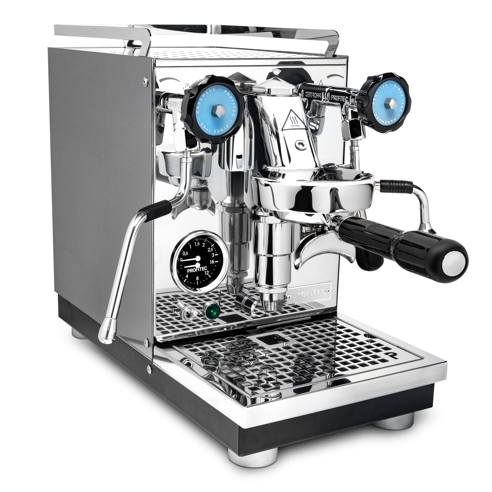

# Profitec Pro 400

> German-engineered E61 HX at the entry-prosumer price point. Three preset brew temperatures via PID, compact footprint, flow-control-ready. The quiet value pick in the $1,500-$2,000 HX bracket.

## Where to buy

- [Clive Coffee](https://clivecoffee.com/products/profitec-400-espresso-machine)
- [Whole Latte Love](https://www.wholelattelove.com/products/profitec-pro-400-espresso-machine)
- [Home Coffee Solutions](https://www.homecoffeesolutions.com/products/profitec-pro-400-heat-exchanger-espresso-machine-with-e61-group-head-pid-temperature-control-black)

## Quick facts

| | |
|---|---|
| **Type** | Heat exchanger, E61 |
| **MSRP** | $1,699 |
| **Street price (Apr 2026)** | $1,699 (Clive Coffee, Whole Latte Love, Home Coffee Solutions) |
| **Dimensions (W×D×H)** | 9.0 × 17.6 × 14.7 in |
| **Weight** | 40.8 lb |
| **Warmup time** | 5-10 min via Eco/Fast Heat Up; 20 min full thermal stability |
| **PID** | **Yes** — three-position preset switch (194/201/208 °F) |
| **Flow/pressure control** | Profitec E61 flow control kit compatible (aftermarket add-on) |
| **Steam wand** | Articulating, 2-hole tip |
| **Portafilter** | 58mm |
| **Plumbable** | No (reservoir only, though some sources indicate plumb conversion possible) |
| **Fits under 16" cabinet** | Yes |

## Specs

- **Boiler:** 1.6 L stainless steel (single HX)
- **Pump:** Vibratory, 15 bar (optimized ~9 bar extraction)
- **Group:** E61 with mechanical pre-infusion
- **Reservoir:** 2.8 L
- **Wattage:** ~1400 W
- **Voltage:** 120 V confirmed
- **Build:** Polished stainless steel; German engineering, Italian parts

## Key features

- **E61 group with stock mechanical pre-infusion** — toggle on/off via switch
- **Three-preset PID** — 194 °F (dark), 201 °F (default), 208 °F (light roast)
- **Dual manometer** — brew + steam pressure visible on a single gauge
- **Digital shot timer**
- **Eco/Fast Heat Up modes**
- **Profitec Flow Control Device (FCD)** compatible — $300-400 aftermarket kit for manual pre-infusion shaping and pressure gauge feedback

The Pro 400 is the direct sibling of the Pro 600 — same chassis dimensions, same E61 group, same overall build philosophy. The 400 drops to a single 1.6 L HX boiler (vs the 600's dual 0.75 + 1.0 L) and switches the PID from per-degree adjustable to three-preset. This saves $700 at MSRP.

## Steam and milk workflow

1.6 L HX boiler provides real commercial-class continuous steam. Simultaneous brew and steam works as expected. The 2-hole tip is standard prosumer fare; upgradeable to 4-hole aftermarket if you want faster milk texturing.

In practice, steam power is competitive with the larger Pro 600 — the boiler architecture prioritizes steam, and single-HX designs typically have more total steam volume than the steam-side of a small DB.

## Brew workflow and temperature stability

Three temperature presets instead of per-degree dial: for most users this is fine (194 for dark, 201 for standard, 208 for light) but power users who dial between 93 and 94 °C for dial-in won't love it. Within each preset, the PID holds the boiler steady; brew-temp via thermosiphon is implicitly set.

Cooling flush recommended after extended idle, like most HX. Shorter than the Appartamento's ritual because the PID keeps the boiler tighter than a pressurestat.

E61 mechanical pre-infusion is stock. Add the FCD flow control kit and the Pro 400 becomes a serious profiling machine — the same kit used on the Pro 500, 600, and 700.

## Grinder pairing

Specialita is well-matched. The Pro 400 rewards a consistent grinder, and the Specialita's output pairs naturally with 58mm E61 workflows. For light-roast pressure profiling with the FCD kit installed, some owners step up to single-dose grinders (Niche, DF64) but this is preference, not necessity.

## Complexity and learning curve

Moderate. Three-preset PID is simpler to operate than per-degree (less temptation to fiddle). Cooling flush discipline is a learned HX skill. The FCD kit, if added, has its own learning curve (how much pre-infusion, when to ramp up) but well-documented.

## Modification and upgrade potential

Strong. The Pro 400 shares parts with the rest of the Profitec E61 line (Pro 500, 600, 700), so aftermarket support is deep:

- **Profitec FCD flow control kit** (~$300-400) — factory-engineered drop-in
- **Steam tip upgrades** (4-hole, 6-hole)
- **OPV adjustment** (internal)
- **Dispersion plate/shower screen upgrades**

## Pros and cons

**Pros**
- German engineering + Italian parts, 3-year warranty
- True E61 HX at $1,699 with stock PID (uncommon value)
- Three sensible brew presets; dual manometer; shot timer
- Flow control kit pathway is factory-engineered
- Compact 9-inch width; lightweight for a Profitec
- Fast Heat Up mode brings warmup to 5-10 min

**Cons**
- **No per-degree PID adjustment** — three presets only
- No programmable volumetrics
- Vibratory pump (quieter rotary available at $700+ more)
- Tank-only on most variants (plumb conversion reportedly possible but not factory standard)
- No stock flow control or brew pressure gauge without the FCD kit
- At $1,699, goes head-to-head with the Lelit Mara X ($1,699) which has dual-sensor PID and reduced flushing — a real head-to-head value question

## Key reviews and references

- [Clive Coffee — Profitec Pro 400 overview](https://clivecoffee.com/blogs/learn/new-from-profitec-the-pro-400-heat-exchanger) — machine overview and E61 benefits
- [Whole Latte Love — Pro 400 review](https://www.wholelattelove.com/blogs/reviews/profitec-pro-400-review) — E61 pre-infusion walkthrough
- [Coffeedant — Pro 400 detailed review (2025)](https://coffeedant.com/espresso-machine/profitec-pro-400/) — real-world temperature presets and intermediate barista fit

## Notable forum threads

- [Home-Barista — Pro 400 vs Pro 600 buying advice](https://www.home-barista.com/advice/buying-new-espresso-machine-budget-1500-2000-critique-list-please-t99961.html)
- [Coffee Forums — Pro 400 pre-infusion discussion](https://www.coffeeforums.co.uk/threads/profitec-pro-400-pre-infusion.71422.html)

## Who it's for

HX buyers who prefer the German/Italian Profitec aesthetic and build over the Lelit or Rocket options, are OK with three preset temperatures (vs per-degree), and want a clear upgrade path to flow control via the FCD kit. Also: someone who plans to eventually upgrade to a Pro 600 or Pro 700 — the 400 is a familiar stepping stone.

**Not** for you if you want per-degree PID (Mara X has three presets too; Classika has per-degree but is single-boiler; Elizabeth has per-degree and is DB). At $1,699 the Mara X's workflow (less flushing thanks to dual-sensor PID) is arguably more refined, though the Pro 400's build quality is a small step up.
