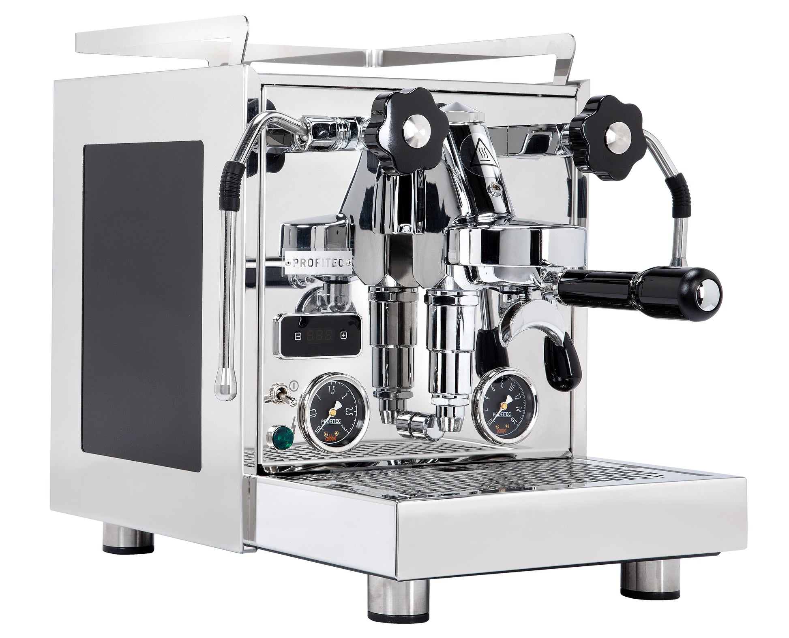

# [Profitec Pro 600](https://www.profitec-espresso.com/en/products)

> The "mid-tier" Profitec E61 dual boiler. Larger steam boiler than the Pro 300/Elizabeth, full E61 group, flow-control-ready via Profitec's FCD kit. Being phased out for the Profitec Ride — inventory status matters.

## Where to buy

- [Whole Latte Love](https://www.wholelattelove.com/products/profitec-pro-600-dual-boiler-espresso-machine)
- [Home Coffee Solutions](https://www.homecoffeesolutions.com/products/profitec-pro-600-dual-boiler) — often bundled with FCD kit
- [Clive Coffee](https://clivecoffee.com/) — transitioning to Profitec Ride but may still stock Pro 600
- [iDrinkCoffee](https://idrinkcoffee.com/products/profitec-pro-600-dual-boiler) — Canadian retailer

## Quick facts

| | |
|---|---|
| **Type** | Dual boiler, E61 |
| **MSRP** | $2,399 |
| **Street price (Apr 2026)** | $2,399 (Whole Latte Love; stock dwindling at Clive as Profitec Ride takes over) |
| **Dimensions (W×D×H)** | 12.0 × 17.6 × 15.6 in |
| **Weight** | 53 lb |
| **Warmup time** | 10 min (Fast Heat Up for espresso); 15 min full steam ready |
| **PID** | **Yes** — dual independent PID, per-degree |
| **Flow/pressure control** | Profitec FCD flow control kit (optional, ~$300-400) |
| **Steam wand** | Offset joystick arms (+1" pitcher clearance), 2-hole tip |
| **Portafilter** | 58mm |
| **Plumbable** | No (tank-only) |
| **Fits under 16" cabinet** | Yes (15.6 in) |

## Availability note

Profitec launched the **Profitec Ride** (late 2024) as the next-generation successor. Clive Coffee has shifted primary stock to the Ride; Whole Latte Love still carries Pro 600 at MSRP as of April 2026. The Pro 600 is a mature, proven product — there's no urgency to switch to the Ride unless you want the new features. Verify current stock with your preferred retailer.

## Specs

- **Brew boiler:** 0.75 L stainless steel, PID-controlled
- **Steam boiler:** 1.0 L stainless steel, 2 bar capable
- **Pump:** Vibratory, 15 bar (optimized to 9 bar)
- **Group:** E61 with mechanical pre-infusion
- **Reservoir:** 3.0 L BPA-free (largest on the DB list)
- **Wattage:** ~1500 W dual heating elements
- **Voltage:** 110-120 V confirmed
- **Build:** Polished stainless steel, matte black accent panels, offset steam arm design

## Key features

The Pro 600 is the Pro 400's sibling with a second boiler bolted on — same chassis, same E61 group, same aesthetics. The differences that matter:

- **Separate steam boiler (1.0 L)** vs the Pro 400's single HX — no mode cycling, no cooling flush, full parallel brew and steam
- **Dual independent PID** — adjust brew and steam temperatures separately, per-degree
- **Larger 3.0 L reservoir** — longer between refills than anything else on this list
- **Offset "quick-steam" arms** — the steam wand and hot water spout are mounted 1" forward vs traditional center mount, giving more pitcher clearance and better steaming angles
- **E61 mechanical pre-infusion** (standard)
- **FCD flow control kit compatibility** (aftermarket, $300-400) — turns the Pro 600 into a full profiling machine

What it doesn't have stock: flow control, rotary pump (the Pro 700 adds both, at +$1,000). For FCD-equipped, you're at ~$2,700-2,800 — still below the Pro 700 or Synchronika.

## Steam and milk workflow

The offset joystick steam arms are a genuinely useful ergonomic upgrade — you can hold a 20 oz pitcher without knuckle-knocking the drip tray. Strong steam pressure from the 1.0 L boiler; comfortable for 2-3 drinks back-to-back.

Simultaneous brew and steam works as designed. 2-hole stock tip is upgradeable to 4-hole for faster texturing.

## Brew workflow and temperature stability

Classic DB stability: dual independent PID, E61 thermal mass, no flushing. Shot-to-shot variance under ±0.5 °C. Dial-in is easy.

With the FCD flow control kit added, you get:
- Manual flow control paddle on the E61 cap (needle valve)
- Brew pressure gauge (0-16 bar) for real-time puck feedback
- Ability to shape pre-infusion (long low-flow soaks) and taper out of shots

This is the same ecosystem as the Pro 500, Pro 700, and the aftermarket-flow-control Synchronikas — well-understood, reversible, well-documented.

## Grinder pairing

Specialita is well-matched. At this price tier, single-dose grinders (Niche Zero, DF64 gen 2) are common upgrade paths if you move into light roasts or serious profiling, but Specialita covers medium roasts and most workflows without issue.

## Complexity and learning curve

Moderate. Stock DB workflow is easy. Adding the FCD kit introduces new skills (how much pre-infusion, when to ramp). The Pro 600 is probably the best "upgrade ceiling" machine on this list — approachable stock, very capable with the kit.

## Modification and upgrade potential

Strong. Shared parts with Pro 400/500/700 makes this one of the most moddable DBs:

- **Profitec FCD flow control kit** (~$300-400) — factory-engineered drop-in
- **Aftermarket steam tips** (4-hole, 6-hole)
- **OPV adjustment** (internal)
- **Panel refinishing** or replacement (cosmetic)

## Pros and cons

**Pros**
- Full E61 group with stock mechanical pre-infusion
- Dual independent PID, per-degree, on both brew and steam
- Largest boiler combo at this price (0.75 L brew + 1.0 L steam)
- 3.0 L reservoir (less frequent refills)
- Offset quick-steam arms (real ergonomic improvement)
- FCD flow control kit pathway is factory-engineered
- German engineering, Italian assembly, 3-year warranty
- Strong shared-parts ecosystem with Pro 400/500/700

**Cons**
- **$2,399** (vs Elizabeth at $1,799) — you pay ~$600 for E61 aesthetics, larger steam boiler, offset arms, and FCD kit compatibility
- No rotary pump (Pro 700 adds rotary + flow control for +$1,000)
- Vibratory pump (mitigated but not silenced)
- No programmable volumetrics (manual shot timing only)
- Being phased out for Profitec Ride — inventory shrinking
- Flow control kit is $300-400 additional
- Tank-only; not plumbable

## Key reviews and references

- [Whole Latte Love — Pro 600 product page and review](https://www.wholelattelove.com/products/profitec-pro-600-dual-boiler-espresso-machine)
- [Coffeedant — Profitec Pro 600 review (2025)](https://coffeedant.com/espresso-machine/profitec-pro-600/) — 8.6/10 score, balanced performance assessment
- [Machina Coffee — Pro 600 review](https://machina-coffee.com/blogs/kit-reviews/profitec-pro-600-our-review) — vs Rocket R58 comparison, ownership notes

## Notable forum threads

- [Home-Barista — Pro 600 user experience and review](https://www.home-barista.com/advice/profitec-600-user-experience-and-review-t81293.html)
- [Home-Barista — remorse between Pro 400 or Pro 600](https://www.home-barista.com/advice/remorse-between-profitec-pro-400-or-600-t98490.html) — classic HX vs DB tradeoff thread

## Who it's for

Someone who wants E61 aesthetics and workflow, values the stock mechanical pre-infusion and the ecosystem of E61 flow control kits, and prefers Profitec's German/Italian build over Lelit's more consumer-y feel. Also: a buyer planning to add flow control later — the Pro 600 is built around the FCD kit upgrade path.

**Not** for you if you want the lowest-price DB (go Elizabeth at $1,800), factory flow control (Bianca $3,000 or Decent $3,700), or a rotary pump (Pro 700 or Synchronika).

For an even milk/espresso user at the $2,500 budget, the Pro 600 is a strong pick — especially if you plan to eventually add the FCD kit for profiling experimentation. If E61 doesn't matter to you, the Elizabeth at $1,800 covers most of the same ground.
