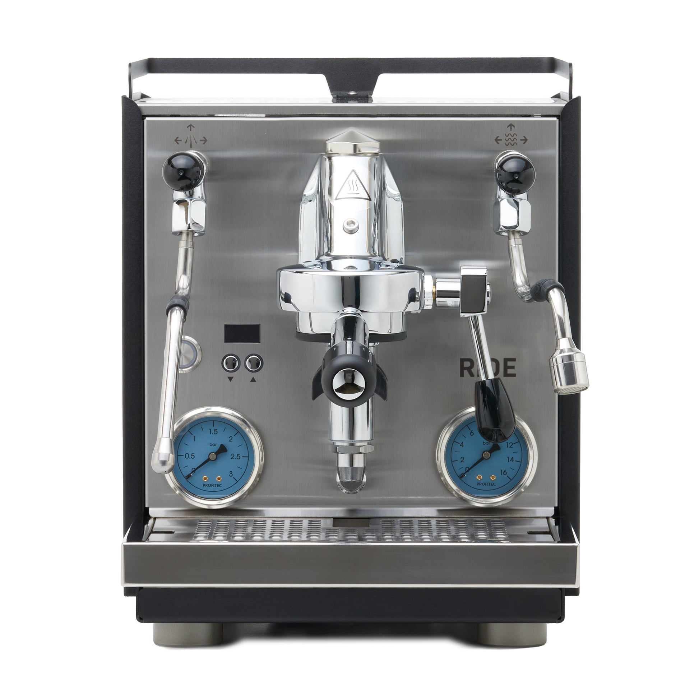

# Profitec Ride

> Profitec's 2024-2025 successor to the Pro 600. Same E61 dual boiler architecture with a redesigned case, simultaneous boiler heating, and OLED PID controls. The "modernized Pro 600" for buyers who want current production and a 3-year warranty.

## Where to buy

- [Clive Coffee](https://clivecoffee.com/products/profitec-ride-espresso-machine)
- [Whole Latte Love](https://www.wholelattelove.com/products/profitec-ride-espresso-machine)

## Quick facts

| | |
|---|---|
| **Type** | Dual boiler, E61 |
| **MSRP** | $2,599 |
| **Street price (Apr 2026)** | $2,599 (Clive Coffee, Whole Latte Love) — matte black + walnut variant $2,899 |
| **Dimensions (W×D×H)** | 11.8 × 22.0 × 14.6 in |
| **Weight** | 61.7 lb |
| **Warmup time** | 8-10 min (fast mode), 10-12 min standard |
| **PID** | **Yes** — dual independent PID, OLED display, per-degree |
| **Flow/pressure control** | E61 flow control kit compatible (aftermarket, ~$300-400) |
| **Steam wand** | No-burn, 2-hole, joystick valve |
| **Portafilter** | 58mm modular with silicone spout attachments |
| **Plumbable** | No |
| **Fits under 16" cabinet** | Yes (14.6 in) |

## Specs

- **Brew boiler:** 0.75 L stainless steel
- **Steam boiler:** 1.0 L stainless steel
- **Pump:** Vibratory with noise damping, 9 bar
- **Group:** E61 with active and passive mechanical pre-infusion
- **Reservoir:** 2.8 L BPA-free
- **Wattage:** 1700 W
- **Voltage:** 115 V US confirmed
- **Build:** #304 stainless steel, handcrafted in Heidelberg, Germany

## Key features

The Ride is the most meaningful Profitec release in years — a from-the-ground-up redesign of the Pro 600 with features not previously available on the Profitec E61 line:

- **Simultaneous boiler heating** — both boilers ramp at once, cutting warmup to 8-10 min (Pro 600 was 10-15 min)
- **OLED PID display with button interface** — more informative than the Pro 600's basic LED display
- **Programmable active pre-infusion** in addition to the passive E61 mechanical ramp
- **Integrated shot timer** on the OLED
- **Programmable volumetrics** (two custom shot buttons) — new to Profitec
- **Modular portafilter** — swap between single and double spout attachments via silicone inserts
- **3-year warranty** via Clive Coffee

What it kept from the Pro 600: same E61 group, same 0.75/1.0 L boiler sizes, same FCD flow control kit compatibility, same German build ethos. This is evolution, not revolution.

## Steam and milk workflow

1.0 L steam boiler gives the same milk performance as the Pro 600. No-burn 2-hole wand with joystick valve is a small ergonomic upgrade. Sub-25-second steaming for 5 oz of milk (Whole Latte Love measurement).

Simultaneous brew and steam; full DB parallel workflow.

## Brew workflow and temperature stability

OLED-driven dual PID with per-degree adjustment. Early reviews report ±2 °F (~±1 °C) temperature stability during extraction — on par with the Pro 600 and the rest of the E61 DB field.

Active pre-infusion programmability is a real feature differentiation vs the Pro 600 (which had only passive E61 pre-infusion). Set a low-flow ramp duration and pressure; the machine executes consistently shot-to-shot.

## Grinder pairing

Specialita is well-matched. Like the Pro 600, the Ride is approachable enough that its stock workflow doesn't demand a grinder upgrade. Add the FCD flow control kit later if you want shot profile experimentation, and a single-dose grinder becomes a nice-to-have.

## Complexity and learning curve

Low. The OLED + button interface is easier to navigate than the Pro 600's setup menus, and programmable volumetrics + shot timer mean the machine handles more variables automatically. Active pre-infusion programmability introduces new settings to explore but doesn't require immediate attention.

## Modification and upgrade potential

- **Profitec / ECM E61 flow control kit** — same FCD kit that fits the Pro 400/500/600/700; proven aftermarket pathway
- **Steam tip swaps** (4-hole for faster milk)
- **LUCCA E61 flow control paddle** — aftermarket alternative to FCD
- **Modular portafilter spouts** — proprietary silicone inserts (slight maintenance overhead)
- **Panel upgrades** — matte black + walnut variant available factory

No rotary pump conversion path (the Ride is vibratory-only); for rotary you'd step up to the Pro 700 or a different manufacturer.

## Pros and cons

**Pros**
- **Simultaneous boiler heating** — fastest warmup in the E61 DB category (~8-10 min)
- OLED PID with programmable active pre-infusion
- Programmable volumetrics (new to Profitec line)
- Full FCD flow control kit compatibility
- Compact for an E61 DB (14.6 in H, 11.8 in W)
- 3-year warranty (Clive Coffee)
- Current production — no phase-out concerns

**Cons**
- **$2,599** vs the older Pro 600 at $2,399 — you pay $200 for the redesign
- Vibratory pump (no rotary option at this tier; Pro 700 is rotary)
- Reservoir-only; no plumb kit
- Modular portafilter is proprietary (silicone spout management adds minor fuss)
- 22-inch depth — longer than most machines; verify counter depth
- Newer product; less long-term reliability data than Pro 600 has accumulated

## Key reviews and references

- [Whole Latte Love — Profitec Ride review](https://www.wholelattelove.com/blogs/reviews/profitec-ride-espresso-machine-review) — Marc Buckman, "simply incredible" temperature stability
- [Clive Coffee — Profitec Ride overview](https://clivecoffee.com/blogs/learn/profitec-ride-espresso-machine-overview) — simultaneous boiler heating deep dive vs Pro 600
- [La Barista (German, translated) — Profitec Ride 2025 test](https://la-barista.com/en/blogs/kaffee-wissen/profitec-ride-test-2025-der-neue-dual-boiler-nachfolger-der-pro-600-im-detail)

## Notable forum threads

- [Home-Barista — Profitec Ride vs Drive buying advice](https://www.home-barista.com/advice/profitec-ride-vs-drive-t99339.html)
- [Home-Barista — new Profitec Ride owner troubleshooting](https://www.home-barista.com/espresso-machines/help-me-understand-new-profitec-ride-t100191.html)

## Who it's for

Someone who wants the Pro 600's feature set in Profitec's current production lineup, values the OLED interface and faster warmup, and wants the 3-year warranty that comes with a new-generation machine. Also: someone buying in 2026-2027 who doesn't want a phased-out product (the Pro 600 stock is dwindling).

**Not** for you if you already have a Pro 600 — the Ride is an incremental upgrade, not a transformative one. If you want rotary + plumbable + flow control factory, step up to the Profitec Pro 700 (~$3,600-3,800) or the Synchronika.

For an even milk/espresso user at the $2,500-2,700 budget, the Ride is a reasonable pick. The **Elizabeth** at $1,799 still wins the pure value argument, and the **Bianca** at $2,999 adds paddle flow control. The Ride sits between them as the "modernized E61 DB" option.
