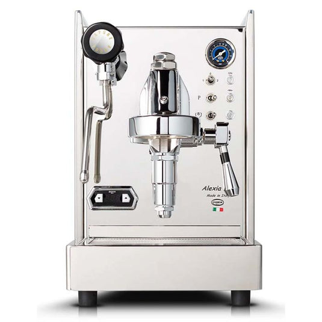

# Quick Mill Alexia Evo

> The cheapest E61 on this list at $1,550, and a legitimate commercial-grade single boiler. Quick Mill's espresso-purist answer to the Profitec Go and Lelit Anna, with a full E61 group and PID.

## Where to buy

- [Comiso Coffee](https://comisocoffee.com/products/quick-mill-alexia-evo-espresso-machine)
- [1st-line.com](https://www.1stincoffee.com/quickmill-alexia.htm) — Quick Mill specialist
- [Espresso Outlet](https://espressooutlet.net/)
- [My Espresso Shop](https://www.myespressoshop.com/)

## Quick facts

| | |
|---|---|
| **Type** | Single boiler with E61 group |
| **MSRP** | ~$1,550 |
| **Street price (Apr 2026)** | $1,550 (Comiso, 1st-line.com, Espresso Outlet, My Espresso Shop) |
| **Dimensions (W×D×H)** | 9.5 × 17.5 × 15.9 in |
| **Weight** | ~38 lb |
| **Warmup time** | 10-12 min |
| **PID** | **Yes, stock** — per-degree with integrated shot timer |
| **Flow/pressure control** | E61 flow control kit available (aftermarket, ~$300-400) |
| **Steam wand** | No-burn, articulating double-wall, 2-hole |
| **Portafilter** | 58mm commercial |
| **Plumbable** | No |
| **Fits under 16" cabinet** | Borderline (15.9 in) — measure carefully |

## Specs

- **Boiler:** 0.75 L brass with T.E.A. surface treatment (insulated)
- **Pump:** Ulka vibratory with pulsor noise reduction
- **Group:** 58mm E61 with mechanical pre-infusion, thermosiphon-fed
- **Reservoir:** 3.0 L with magnetic low-water sensor (largest on the single boiler list)
- **Wattage:** 1400 W
- **Voltage:** 110 V US confirmed
- **Build:** #304 stainless steel; Italian prosumer construction

## Key features

The Alexia Evo is the rare single-boiler machine with a real E61 group. Most E61 machines have larger boilers (HX or DB); the Alexia is single-boiler E61, which is an unusual intersection. This matters because:

- **E61 mechanical pre-infusion is stock** — soft wet-up before full pressure, same as prosumer HX and DB E61 machines
- **E61 flow control kits are directly compatible** — the Alexia can accept the same FCD kit that fits Profitec Pro 400/600, turning it into a full profiling machine for ~$1,900 total

What the single boiler costs you: serial brew/steam workflow. Same fundamental limitation as the Anna or Silvia — cycle to steam, steam, cycle back (or flush) to brew.

Other features:
- **Stock PID** with per-degree brew temperature control and shot timer (activates when E61 lever raised)
- **3.0 L reservoir** — largest on the single-boiler list
- **No-burn articulating wand** — ergonomically superior to stock Gaggia/Silvia wands

## Steam and milk workflow

Small 0.75 L boiler in steam mode — adequate for 1 drink per session comfortably, 2 in a row with patience. The no-burn 2-hole wand is better ergonomics than the Silvia 1-hole wand, and produces microfoam with slightly less technique demand.

**No simultaneous brew+steam** — this is still a single boiler.

## Brew workflow and temperature stability

PID + E61 thermosiphon + 0.75 L brass boiler delivers shot-to-shot variance under ±1 °C, matching other PID'd single boilers. The E61 mechanical pre-infusion is the quality differentiator vs the Anna and Silvia — longer gentle wet-up, more forgiving of distribution errors.

With the flow control kit added, the Alexia becomes one of the most sophisticated single-boiler-format espresso workflows available at any price. You get:
- Mechanical pre-infusion via E61
- Manual flow control via needle valve paddle
- Brew pressure gauge (0-16 bar) for real-time puck feedback
- PID temperature control

This is essentially the ECM Classika PID + flow control setup at $100-150 less.

## Grinder pairing

Specialita is ideal. The Alexia rewards grinder consistency directly; flow control (if added) especially benefits from low-fines output.

## Complexity and learning curve

Moderate. Stock operation is simple (pull shot, flip switch, steam, cycle back). The single-boiler brew/steam cycle is the main workflow friction. The flow control paddle, if added, has its own learning curve but well-understood.

## Modification and upgrade potential

Strong, thanks to E61:

- **E61 flow control kit** (Quick Mill or aftermarket, ~$300-400) — direct compatibility, transforms the machine
- **Steam tip upgrades** (4-hole, 6-hole) — aftermarket
- **Bottomless portafilter** — 58mm standard
- **IMS shower screens and baskets**
- **OPV adjustment** — standard

Quick Mill parts availability is excellent through specialty retailers (1st-line.com, Chris' Coffee, Comiso).

## Pros and cons

**Pros**
- **Cheapest E61 on this list** at $1,550
- 58mm commercial portafilter, full accessory ecosystem
- Stock PID with shot timer
- Real E61 mechanical pre-infusion
- E61 flow control kit directly compatible
- 3.0 L reservoir, no-burn wand, polished stainless build
- Italian prosumer construction

**Cons**
- **Single boiler** — no simultaneous brew+steam; serial workflow
- Smaller Quick Mill community in the US vs Profitec/ECM/Lelit — fewer YouTube reviews, fewer forum threads
- 15.9 in height is borderline under 16" cabinets
- No flow control stock; upgrade costs add ~$300-400
- Smaller steam boiler than HX; slower multi-drink milk workflows
- Less retailer presence in the US (fewer outlets than Profitec/Lelit)
- No programmable volumetrics

## Key reviews and references

- [Coffeedant — Quick Mill Alexia Evo + flow control review](https://coffeedant.com/espresso-machine/quick-mill-alexia-evo-flow/) — emphasizes E61 + flow control combo for manual profiling
- [Home-Barista — Alexia original buyer's guide (still largely applicable)](https://www.home-barista.com/quickmill-alexia-review.html)
- [Home Grounds — Alexia Evo review](https://www.homegrounds.co/quick-mill-alexia-evo-review/) — "ideal for specialty coffee lover who prefers straight espresso"

## Notable forum threads

- [Home-Barista — Quick Mill Alexia review and discussion](https://www.home-barista.com/quickmill-alexia-review.html)
- Limited Evo-specific threads on Home-Barista as of April 2026 — most ongoing discussion is in older Alexia threads, which remain largely applicable

## Who it's for

Espresso-first buyers who want real E61 workflow in a single-boiler footprint and at a single-boiler-adjacent price. Also: someone planning to add flow control later (the $1,550 + ~$350 kit = $1,900 configuration is a serious espresso-focused setup).

**Not** for you if milk drinks are half or more of your cups — the single-boiler serial workflow will frustrate. The ECM Classika PID ($1,699) is the closest peer and is also single-boiler E61; pick by brand preference and retailer availability.

For an even milk/espresso user: not the right architecture for your workflow. Consider the Mara X ($1,699, true HX) instead at the same price band.
