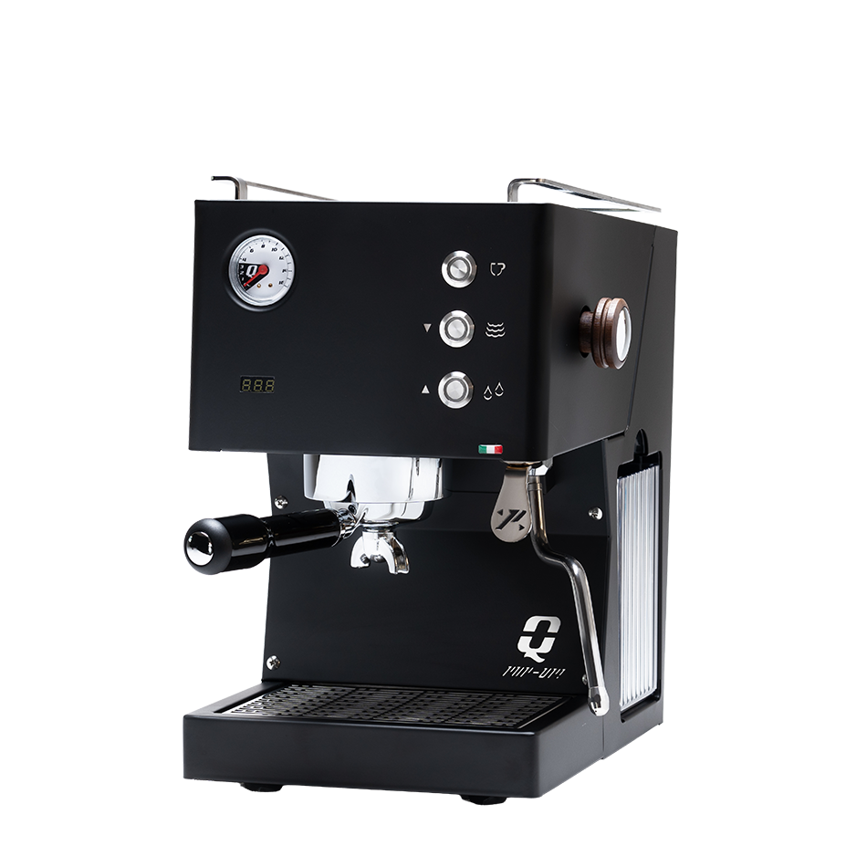

# Quick Mill Pop Up

> A compact single-boiler machine with stock paddle flow control, a saturated-style brew group, and dual gauges at $1,295 — easily the cheapest factory flow-control machine on this list, and unusual architecture for the price.

## Where to buy

- [Clive Coffee](https://clivecoffee.com/products/quick-mill-pop-up-espresso-machine) — primary US retailer
- [Quick Mill (manufacturer)](https://www.quick-mill.com/products/pop-up/)
- [1st-line.com](https://www.1stincoffee.com/) — Quick Mill specialist (check current listing)

## Quick facts

| | |
|---|---|
| **Type** | Single boiler, saturated-style group |
| **MSRP** | $1,295 |
| **Street price (Apr 2026)** | $1,295 (Clive Coffee) |
| **Dimensions (W×D×H)** | 10.25 × 13.0 × 14.45 in |
| **Weight** | 35 lb |
| **Warmup time** | ~15 min |
| **PID** | **Yes, stock** — per-degree (°F or °C) with shot timer |
| **Flow/pressure control** | **Paddle (stock)** — flow control for pressure profiling and pre-infusion |
| **Steam wand** | Articulating, insulated, 2-hole commercial tip |
| **Portafilter** | 58mm commercial |
| **Plumbable** | No — reservoir only |
| **Fits under 16" cabinet** | Yes (14.45 in) |

## Specs

- **Boiler:** 0.45 L brass, insulated
- **Pump:** Vibratory (Quick Mill's own ~30% noise-reduced unit), 9 bar brew
- **Group:** Saturated-style "ring" brew group (Quick Mill's terminology); Clive and other US retailers describe it as a saturated group
- **Reservoir:** 1.8 L side-mounted, removable
- **Wattage:** 1200 W (US 120V)
- **Voltage:** 120V 60Hz US confirmed
- **Build:** Full stainless steel body, available in polished stainless or matte black; wooden steam-knob accent

## Key features

The Pop Up is an unusual machine for its price band. What it brings at $1,295:

- **Stock paddle flow control** — there is no other machine on this list with factory paddle flow profiling anywhere near this price. The next one up is the Lelit Bianca at $2,999. The Alexia Evo, ECM Classika PID, and Pro 400 all require aftermarket kits ($300-400) to do what the Pop Up does stock.
- **Saturated-style brew group** — direct-heated group with thermal-mass stability characteristics closer to an E61 than a thermoblock. Quick Mill calls it a "ring brew group"; US retailers describe it as saturated.
- **Dual gauges** — both pump pressure and boiler pressure (each 0-16 bar), which is typical of HX/DB machines costing twice as much.
- **Per-degree PID** with Fahrenheit or Celsius display and integrated shot timer.
- **Programmable pre-infusion**, eco-mode, and standby.
- **Compact footprint** — 10.25 × 13 × 14.45 in fits under any standard US cabinet with room to spare.

What it doesn't have: a second boiler (so no simultaneous brew+steam), a large steam boiler for back-to-back milk drinks, or plumbing capability.

## Steam and milk workflow

Standard single-boiler cycle: pull shot, switch to steam mode, wait ~30 seconds for pressure, steam, then flush/cycle to brew. The 0.45 L brass boiler is small — appropriate for one 10-12 oz drink per cycle.

The steam wand is the ergonomic win here: articulating, insulated (no-burn) construction with a 2-hole commercial tip. It's genuinely better than the Silvia/Gaggia/Anna stock wands and on par with the Profitec Go's wand. Steam pressure is adequate for a single latte or cappuccino with competent technique; back-to-back drinks require boiler recovery.

**No simultaneous brew+steam.** This is the fundamental single-boiler limitation, same as the Silvia, Anna, Go, and Alexia Evo.

## Brew workflow and temperature stability

The saturated-style brew group plus per-degree PID on a 0.45 L brass boiler delivers stable shot-to-shot temperatures. Expected variance is ±0.5 °C range — comparable to other well-PID'd single boilers.

The real workflow differentiator is the **paddle flow control**. Out of the box, you can:

- Soft pre-infuse manually (paddle partially open, low pressure wet-up)
- Ramp into full pressure on your own timeline
- Taper down at the end of the shot to soften bitter extraction
- Cut flow entirely mid-shot if channeling shows on the bottomless portafilter

This is mechanical, tactile profiling without the aftermarket kit tax. On a single-boiler machine at this price, it's genuinely unique.

Programmable electronic pre-infusion is also available for users who want repeatability instead of hands-on paddle work.

## Grinder pairing

The Eureka Mignon Specialita is well-matched. Flow control benefits from consistent grind — the Specialita's 55mm burrs are fine enough to handle light-to-medium roasts where paddle profiling adds the most value. No grinder upgrade needed.

A single-dose grinder upgrade (Niche Zero, DF64 Gen 2) would extract more value from the flow control paddle by reducing fines and retention, but the Specialita is not a bottleneck.

## Complexity and learning curve

Moderate. Stock operation (without engaging the paddle) is as simple as any PID'd single boiler. Learning to use the paddle effectively takes practice — most owners spend 2-4 weeks developing a feel for pre-infusion length, peak pressure ramp, and decline timing.

The single-boiler brew/steam cycle is the main workflow friction; daily use is no more complex than an Anna or Silvia.

Programmable pre-infusion gives you a middle path: set a soft wet-up electronically, then use the paddle only for end-of-shot decline.

## Modification and upgrade potential

Limited compared to E61 machines. The saturated-style group is proprietary to Quick Mill, so no aftermarket flow control kits or shower-screen ecosystem like the E61 machines have.

- **Bottomless portafilter** — 58mm commercial, standard
- **IMS baskets** — 58mm standard, compatible
- **Steam tip swap** — limited aftermarket availability for Quick Mill proprietary wands

The core upgrade (flow control) is already built in, so the machine doesn't invite heavy modification the way an E61 does.

## Pros and cons

**Pros**
- **Cheapest stock paddle flow control on this list** by $1,700+
- Saturated-style brew group at a price point usually limited to thermoblock/single-boiler architecture
- Per-degree PID with shot timer stock
- 58mm commercial portafilter, articulating insulated steam wand
- Dual pressure gauges (pump + boiler)
- Programmable pre-infusion, eco-mode, standby
- Compact footprint (14.45" H, 10.25" W) — fits comfortably under 16" cabinets
- Full stainless build with matte-black option

**Cons**
- **Single boiler** — no simultaneous brew+steam; serial workflow limits back-to-back milk drinks
- Small 0.45 L boiler — limits steam capacity for multi-drink sessions
- ~15 min warmup is longer than the Profitec Go (5-6 min) or Lelit Anna (3-5 min)
- Not plumbable
- Proprietary group — no flow-control kit ecosystem, limited accessory swaps
- Relatively new in the US market — small owner community, few long-term reviews
- Small US retailer presence vs Profitec/Lelit/ECM
- Quick Mill's US support channel is narrower than the big-three brands

## Key reviews and references

- [Clive Coffee product page — editorial summary](https://clivecoffee.com/products/quick-mill-pop-up-espresso-machine) — positions as "single-boiler espresso machine that punches well above its price point"
- [Quick Mill manufacturer page](https://www.quick-mill.com/products/pop-up/) — official specs and feature list
- As of April 2026, long-form third-party reviews (Coffeedant, Home Grounds, Seattle Coffee Gear video) are limited — the Pop Up is a recent addition to Quick Mill's US lineup. Cross-check community opinion before purchase.

## Notable forum threads

- [Home-Barista — Quick Mill category](https://www.home-barista.com/) — limited Pop Up-specific threads as of April 2026
- [Reddit r/espresso](https://www.reddit.com/r/espresso/) — search "Quick Mill Pop Up" for current owner reports

## Who it's for

Espresso-focused buyers who want stock paddle flow control and a saturated-style group for under $1,500, and who are comfortable with single-boiler workflow (solo drinker, one or two drinks per session, occasional milk). It's the cheapest way to own a factory flow-control machine by a wide margin.

**Not** for you if milk drinks are more than a third of your cups — the 0.45 L boiler and single-boiler brew/steam cycle will grind on you. For an even milk/espresso split, the Lelit Mara X ($1,699 HX) or Lelit Elizabeth V3 ($1,799 DB) is a better architectural fit at a modest premium. Also not the right machine if you want a traditional E61 feel (the Alexia Evo at $1,550 or Pro 400 at $1,699 are the E61 peers) or a deep accessory/mod ecosystem.
