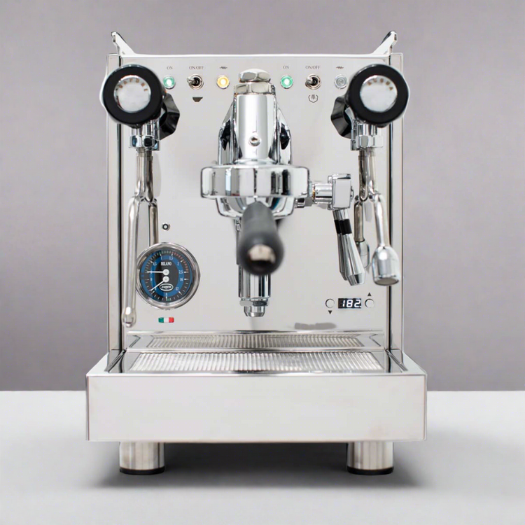

# Quick Mill QM67 Evo

> Quick Mill's flagship compact E61 dual boiler. Independent dual PID, 58mm E61, integrated shot timer, Italian build. The "compact DB" value pick that flies under the Profitec/ECM radar.

## Where to buy

- [Chris' Coffee](https://www.chriscoffee.com/products/quick-mill-qm67-evo) — standard retailer with 2-year warranty
- [Comiso Coffee](https://comisocoffee.com/products/quick-mill-qm-67-evo-espresso-machine) — often cheapest
- [Coffeeionado](https://coffeeionado.com/) — free shipping, 2-year warranty
- [Bendix Coffee Roasters](https://bendixcoffee.com/)
- [My Espresso Shop](https://www.myespressoshop.com/)

## Quick facts

| | |
|---|---|
| **Type** | Dual boiler, E61 |
| **MSRP** | ~$2,495 |
| **Street price (Apr 2026)** | $2,395-$2,495 (Chris' Coffee $2,495 w/ 2-yr warranty; Comiso $2,395) |
| **Dimensions (W×D×H)** | 11.25 × 17.75 × **16.25** in — **exceeds 16" clearance** |
| **Weight** | ~50 lb |
| **Warmup time** | 12-15 min |
| **PID** | **Yes, stock** — dual independent, per-degree, integrated shot timer |
| **Flow/pressure control** | E61 flow control kit compatible (aftermarket, ~$300-400) |
| **Steam wand** | Articulating stainless (specifics vary by year); 2-hole |
| **Portafilter** | 58mm commercial |
| **Plumbable** | No |
| **Fits under 16" cabinet** | **No (16.25 in)** — verify cabinet height before purchase |

## Specs

- **Brew boiler:** 0.75-0.8 L stainless steel, insulated
- **Steam boiler:** 1.0 L stainless steel, insulated
- **Pump:** Ulka vibratory (52 W)
- **Group:** 58mm E61 with thermosiphon heating
- **Reservoir:** 3.0 L with hinged cup tray access
- **Wattage:** ~1600-1800 W (US 110 V)
- **Voltage:** 110 V US confirmed
- **Build:** Stainless steel (refreshed "nearly all-stainless" panels on Evo); Italian-built

## Key features

- **Dual independent PID** — each boiler tuned separately, per-degree, with integrated shot timer
- **Two manometers** — brew and steam pressure, both visible
- **E61 group with mechanical pre-infusion** — stock
- **Eco modes** — steam off after 60 min idle, full shutdown after 120 min
- **Heavy-duty 9 lb E61 group** — significant thermal mass
- **Hinged cup tray design** — reservoir access without lifting
- **Integrated shot timer on the PID display**

Compared to the Profitec Pro 600 ($2,399) and Pro Ride ($2,599): the QM67 is the Italian alternative with similar architecture, arguably better integrated shot timer placement, and slightly better value at $2,395-2,495 depending on retailer. The main downsides vs Profitec: smaller US brand presence (fewer reviews, fewer retailers) and the height problem (16.25 in).

## Steam and milk workflow

1.0 L steam boiler delivers comfortable home-scale steam. Not as large as Synchronika's 2 L, but on par with Pro 600/Ride. 2-hole wand stock; upgrade to 4-hole if you make many milk drinks.

Simultaneous brew and steam works as designed.

## Brew workflow and temperature stability

Dual PID with separate control of brew and steam boilers. E61 thermosiphon keeps the group at target between shots; no flushing ritual required. Shot timer via PID display. Coffeedant describes this as "a PID shot timer that keeps you honest" — small UX win.

Shot-to-shot variance ±0.5-1 °C, typical of well-designed E61 DBs.

## Grinder pairing

Specialita is well-matched. At this price point and DB feature set, the grinder isn't the bottleneck.

## Complexity and learning curve

Low. Same DB workflow as Pro 600/Ride — pull shot, steam, don't flush, repeat. The PID display is clean and informative. No cooling flush overhead.

## Modification and upgrade potential

Strong via E61 ecosystem:

- **E61 flow control kit** — Quick Mill or aftermarket, ~$300-400
- **Steam tip upgrades** — 4-hole, 6-hole
- **Aftermarket pressure gauges**
- **Standard 58mm accessories** — universal
- **Parts availability** — good through Chris' Coffee, 1st-line, Bendix

## Pros and cons

**Pros**
- **True dual boiler in a compact 11.25-inch-wide chassis**
- Dual independent PID per-degree with integrated shot timer
- E61 group with mechanical pre-infusion
- Simultaneous brew and steam
- Two pressure gauges (brew + steam)
- Stainless steel construction, Italian build
- Competitive pricing ($2,395-2,495 vs Pro 600 at $2,399 and Ride at $2,599)
- Quick Mill reliability reputation (long production history)
- Eco modes for standby power

**Cons**
- **Height 16.25 in** — exceeds a standard 16-inch under-cabinet clearance. **This will not fit** under many US kitchen cabinets as-is. Primary dealbreaker for this wiki's target buyer.
- No flow control stock; aftermarket kit adds $300-400
- No programmable volumetrics
- No rotary pump option at this tier
- Smaller US brand presence than Profitec/ECM/Lelit — fewer YouTube reviews, fewer forum threads
- Reservoir-only; no plumb
- No programmable pre-infusion (only passive E61 mechanical)
- 12-15 min warmup is longer than the Profitec Ride's 8-10 min

## Key reviews and references

- [Coffeedant — Quick Mill QM67 Evo review](https://coffeedant.com/espresso-machine/quick-mill-qm67-evo/) — "PID shot timer that keeps you honest"
- [Homegrounds — Best Quick Mill espresso machines 2026](https://www.homegrounds.co/best-quick-mill-espresso-machines/) — positions QM67 as "the adult in the compact dual-boiler room"
- [Foodal — Quick Mill QM67 Evo review](https://foodal.com/drinks-2/coffee/espresso-machines/quick-mill-qm67-review/)

## Notable forum threads

- [Home-Barista — Used Quick Mill QM67 vs other options](https://www.home-barista.com/advice/used-quick-mill-qm67-vs-other-options-t88301.html) — recent ownership discussion, reliability notes
- Home-Barista has ongoing threads for the QM67 line dating back several years — many largely apply to the Evo refresh

## Who it's for

Someone with **cabinet clearance of at least 16.5 inches** who wants a compact Italian-built dual boiler with E61 and integrated dual PID. Also: someone who prefers to avoid the more visible Profitec/ECM brands and enjoys the smaller-brand Quick Mill parts ecosystem.

**Not** for you if your under-cabinet clearance is 16 inches or less — the QM67 Evo will not fit flush under most US standard cabinets. This is a binary constraint; no amount of feature quality compensates. In that case: **Profitec Pro 600 (15.6 in)**, **Profitec Ride (14.6 in)**, or **Lelit Bianca V3 (15.75 in)** are the fit-friendly alternatives.

If clearance is not a constraint, the QM67 is genuinely competitive with the Pro 600 at a slightly lower street price. Chris' Coffee's 2-year warranty is a real plus.
