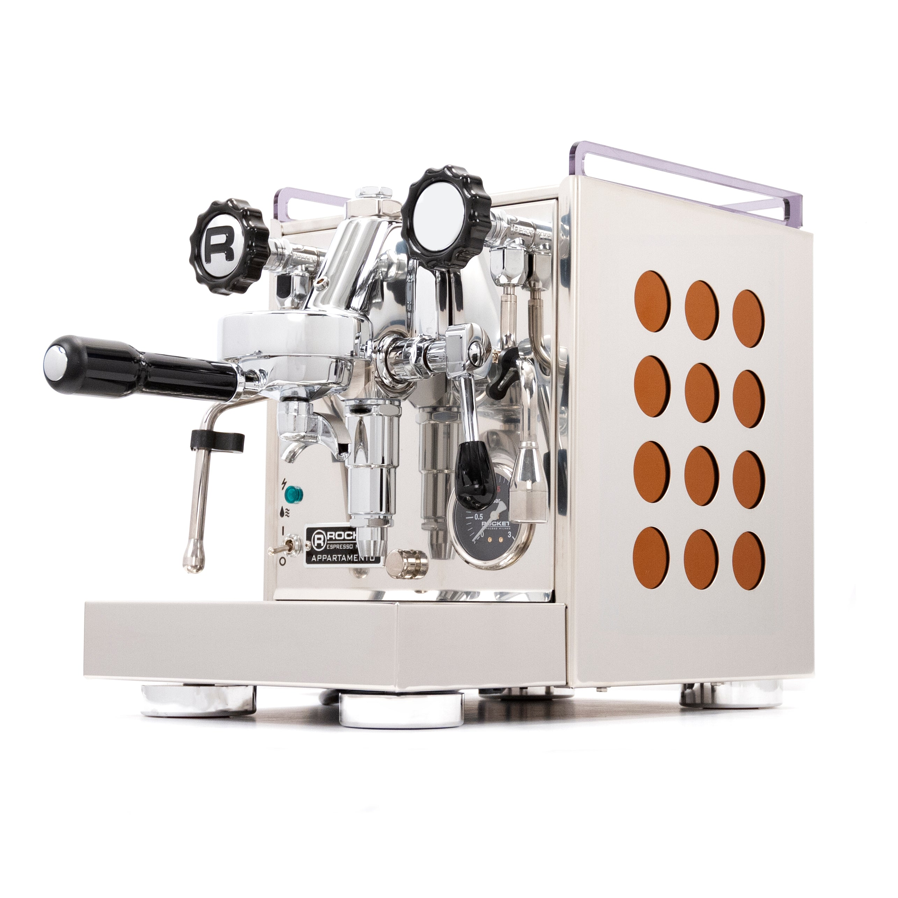

# Rocket Appartamento

> Italian hand-built E61 HX in a compact footprint. The machine you buy when you want a commercial-feel heart on a home-counter scale, and you don't need a PID.

## Where to buy

- [Whole Latte Love](https://www.wholelattelove.com/products/rocket-espresso-appartamento)
- [Seattle Coffee Gear](https://www.seattlecoffeegear.com/products/rocket-espresso-appartamento-espresso-machine)
- [Clive Coffee](https://clivecoffee.com/products/rocket-appartamento-tca-espresso-machine) — TCA variant

## Quick facts

| | |
|---|---|
| **Type** | Heat exchanger, E61 |
| **MSRP** | $2,050 |
| **Street price (Apr 2026)** | $1,850-$2,050 (Seattle Coffee Gear, Whole Latte Love) |
| **Dimensions (W×D×H)** | 10.8 × 16.7 × 14.2 in |
| **Weight** | 47.5 lb |
| **Warmup time** | ~20 min |
| **PID** | **No** (the Appartamento TCA variant adds brew temp adjustment via dedicated probe, at a ~$250 premium) |
| **Flow/pressure control** | None stock; aftermarket flow control kits available |
| **Steam wand** | 2-hole, cool-touch double-wall (Rocket's patented design) |
| **Portafilter** | 58mm |
| **Plumbable** | Yes |
| **Fits under 16" cabinet** | Yes (14.2 in tall; **16.7 in deep**, check counter depth) |

## Specs

- **Boiler:** 1.8 L copper (single HX boiler)
- **Pump:** Vibratory, 15 bar
- **Group:** E61 with dual pre-infusion (static chamber + progressive piston)
- **Reservoir:** 2.5 L, removable
- **Wattage:** 1200 W
- **Voltage:** 120V confirmed (US 15A)
- **Build:** Stainless steel with color-matched side panels; hand-assembled in Milan

## Key features

The Appartamento is the "apartment-sized" version of the full Rocket line — a proper E61 HX in a 10.8-inch-wide footprint. What you get:

- **E61 group with mechanical pre-infusion** — the hallmark ramp-and-soak of the E61 is present and does its job well
- **Copper boiler** — 1.8 L is generously sized for steaming; copper has superior thermal mass and transfer to stainless
- **Cool-touch steam wand** — double-walled, doesn't burn when you grab it right after steaming
- **Plumbable** — can be converted to pressurized line with the optional kit
- **Pressurestat-controlled** — no PID, but the pressurestat is accurate and steam pressure can be adjusted

What it lacks (important): **no PID**. Brew temperature is set implicitly by steam boiler pressure and thermosiphon dynamics. Owners adjust brew temperature by tweaking the pressurestat; it's effective but less precise than a PID'd HX like the Lelit Mara X. If PID is a hard requirement, the Appartamento TCA variant adds brew temp adjustment but costs more.

## Steam and milk workflow

Strong. The 1.8 L copper boiler provides continuous steam for multiple pitchers, and the 2-hole cool-touch wand produces microfoam efficiently. This is classic Italian-café steaming in a home machine.

Simultaneous brew and steam works as designed — pull a shot while steaming milk, one of the biggest quality-of-life upgrades over any single boiler.

## Brew workflow and temperature stability

The standard HX ritual: after idle, pull a "cooling flush" of a few ounces to bring thermosiphon water to brew temp before locking in the portafilter. Once you're pulling back-to-back shots, the group stays stable.

Without PID, brew-temp variance is larger than a PID'd HX or any DB — typical ±1-2 °C depending on idle time and flush discipline. Acceptable for medium roasts; tighter discipline needed for light roasts at the edge of extraction.

No brew pressure gauge stock (the TCA variant adds one). The steam boiler pressure gauge is your only feedback unless you add a flow control kit or naked portafilter.

## Grinder pairing

Specialita is well-matched. The Appartamento's mechanical pre-infusion via E61 plus 1.8 L steam capacity lets the Specialita show its ceiling. A slight step up to Niche Zero or DF64 gen 2 would unlock marginally more; you're not giving anything up with the Specialita.

## Complexity and learning curve

Moderate. Cooling flush discipline is a real learned ritual; forget to flush after a 30-min idle and your first shot is too hot. Steaming is easy. Pressurestat adjustment for brew temperature tuning is a minor technical skill (top-panel accessible).

Once you've learned the machine, daily workflow is comfortable.

## Modification and upgrade potential

Moderate. The Appartamento benefits from several common mods:

- **Flow control kit** — aftermarket needle valve on the E61 cap, ~$150-250, enables manual pre-infusion shaping
- **Steam tip swap** (1-hole, 3-hole, 4-hole options) — tailor to milk pitcher size
- **Pressurestat adjustment** — built-in, no parts needed, tune steam pressure
- **IMS baskets and shower screens**

No open-source controller communities — this is a traditional E61 machine that rewards mechanical understanding, not software hacking.

## Pros and cons

**Pros**
- Hand-built in Milan; copper boiler; real commercial-grade internals
- Compact for a full E61 HX (10.8 in wide)
- Simultaneous brew+steam; strong 1.8 L steam capacity
- Cool-touch wand; pleasant ergonomics
- Plumbable; E61 serviceability means 10+ year lifespan
- Aesthetic — the Appartamento is genuinely beautiful, with color options (copper, white, black, red)

**Cons**
- **No PID stock** — surprising at $1,900-$2,000 in 2026
- No brew pressure gauge stock
- Cooling flush required; brew temp less precise than PID HX or DB
- 47.5 lb — heaviest single-boiler-style machine on this list
- TCA variant (with brew probe) is $300 more and still not a true PID

## Key reviews and references

- [Coffeeness.de — Rocket Appartamento 2026 review](https://www.coffeeness.de/en/rocket-appartamento-review/) — "Fly me to the moon"; notes stainless build and drip tray size tradeoff
- [Whole Latte Love — Appartamento video review](https://www.youtube.com/watch?v=4yDyFi0UsE8) — internal tour and build quality demo
- [Seattle Coffee Gear product page + crew commentary](https://www.seattlecoffeegear.com/products/rocket-espresso-appartamento-espresso-machine)

## Notable forum threads

- [Home-Barista — Profitec Pro 300 vs Rocket Appartamento](https://www.home-barista.com/advice/profitec-300-pro-vs-rocket-appartamento-t42637-20.html) — extensive DB-vs-HX discussion
- [Home-Barista — new Appartamento steam pressure](https://www.home-barista.com/espresso-machines/new-rocket-appartamento-is-this-right-steam-pressure-t55130.html) — pressurestat tuning reference

## Who it's for

Someone who values hand-assembled Italian build, wants commercial-grade steam and simultaneous brew+steam, is OK with the cooling-flush ritual, and doesn't need PID precision for their roast style. The Appartamento is also the "looks right on a kitchen counter" choice — it photographs beautifully and ages well.

**Not** for you if you want PID precision, light-roast-capable brew stability without flushing, or the lowest possible learning curve. For those, Lelit Mara X is a better HX choice and costs $300 less.

For an even milk/espresso user on a $3,000 budget, the Appartamento is a fine pick — but the Mara X's PID'd thermosiphon and lower price arguably dominate it unless you specifically want the Rocket build/aesthetic.
