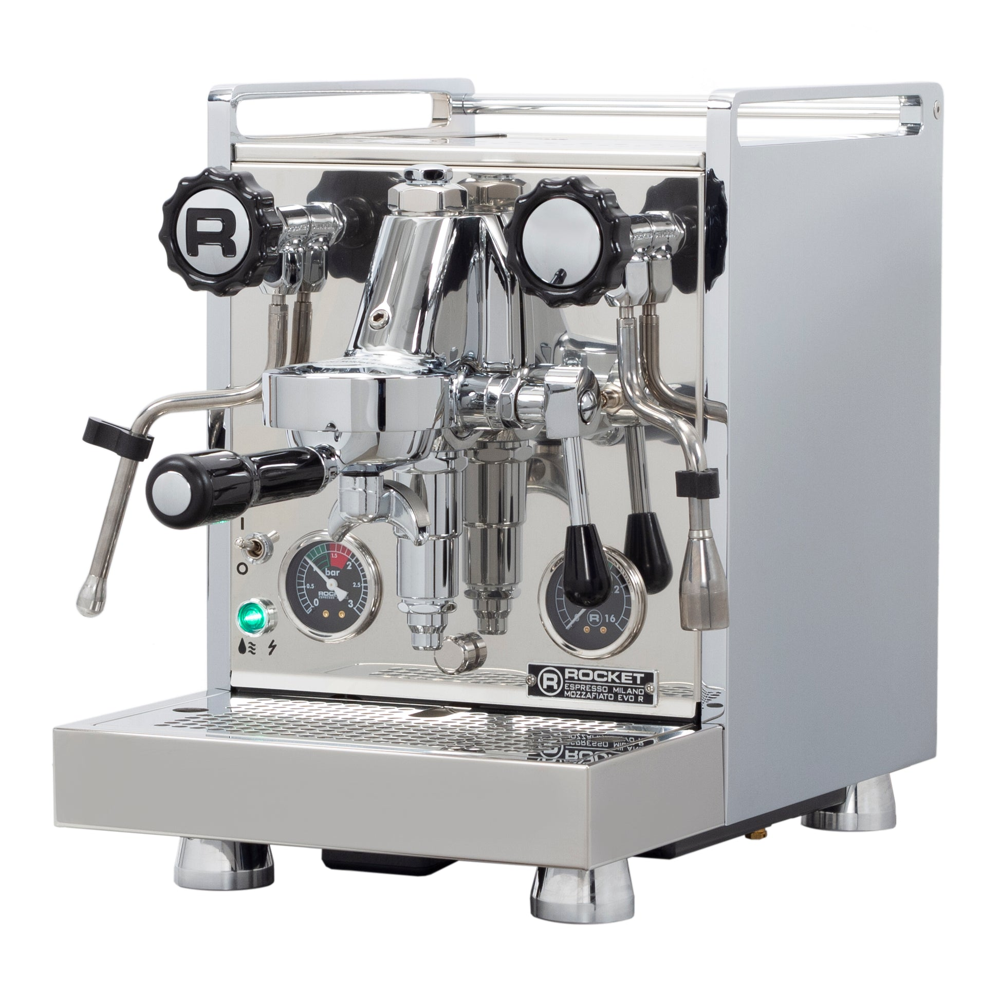

# [Rocket Mozzafiato Evoluzione R](https://rocket-espresso.com/products/domestic-models/mozzafiato-r)

> Full-size Rocket E61 HX with a rotary pump and PID. Near-silent operation, 1.8 L copper boiler, plumbable. The most premium HX on this list, and it competes in price with several dual boilers.

## Where to buy

- [Seattle Coffee Gear](https://www.seattlecoffeegear.com/products/rocket-espresso-mozzafiato-timer-evoluzione-r-espresso-machine)
- [Whole Latte Love](https://www.wholelattelove.com/products/rocket-espresso-mozzafiato-evoluzione-r)
- [Home Coffee Solutions](https://www.homecoffeesolutions.com/products/rocket-mozzafiato-evoluzione-r-espresso-machine-with-pid-temperature-control)

## Quick facts

| | |
|---|---|
| **Type** | Heat exchanger, E61, rotary pump |
| **MSRP** | $3,100 |
| **Street price (Apr 2026)** | $3,100 (Seattle Coffee Gear, Whole Latte Love, Home Coffee Solutions) |
| **Dimensions (W×D×H)** | 11.0 × 16.75 × 15.75 in |
| **Weight** | 66.5 lb |
| **Warmup time** | ~20 min |
| **PID** | **Yes** — brew temperature control (hidden behind drip tray) |
| **Flow/pressure control** | None stock; aftermarket flow control kits available |
| **Steam wand** | Standard Rocket commercial, 2-hole |
| **Portafilter** | 58mm |
| **Plumbable** | **Yes** (internal rotary pump, factory feature) |
| **Fits under 16" cabinet** | Tight (15.75 in) — measure carefully |

## Specs

- **Boiler:** 1.8 L copper (insulated, single HX)
- **Pump:** **Rotary** — quiet operation, plumbable
- **Group:** E61 with integrated dual pre-infusion (mechanical piston + static chamber)
- **Reservoir:** 2.5 L (optional direct plumb)
- **Wattage:** 1200 W
- **Voltage:** 120 V confirmed
- **Build:** Polished stainless steel chassis; copper/brass boiler with insulation; hand-assembled in Milan

## Key features

The Mozzafiato Evoluzione R is the step-up in the Rocket HX line from the Appartamento. The big differentiators:

- **Rotary pump** — near-silent operation; professional feel; plumb-in ready
- **PID** — brew temperature adjustment (via hidden panel behind drip tray; not as convenient as front-panel PIDs)
- **Integrated electronic shot timer** with auto-detection
- **Dual pre-infusion system** — mechanical piston + static chamber via the E61 group
- **Full-size Rocket aesthetic** — color-matched panels, polished stainless

Everything else about the experience is standard E61 HX: simultaneous brew and steam, cooling flush recommended after idle, commercial-style steam wand.

## Steam and milk workflow

Strong. 1.8 L copper boiler, standard Rocket 2-hole commercial wand. The machine has essentially the same steam experience as the Appartamento but with less overall pump vibration because the rotary pump is idle-quiet between shots. Commercial-class milk performance.

## Brew workflow and temperature stability

With PID, shot-to-shot variance is tighter than a pressurestat HX — typically ±0.5-1 °C. The PID is adjustable but panel access is hidden (behind the drip tray), which means you set brew temp once and leave it. Not a machine for constant dial-adjustment.

E61 mechanical pre-infusion is standard. The rotary pump's steady line pressure also means pre-infusion feels slightly different from vibratory pump machines — smoother ramp into full pressure.

Cooling flush: yes, still recommended after extended idle. The PID helps but doesn't eliminate the thermosiphon dynamics of an HX.

## Grinder pairing

Specialita is fine. At the $3,000 price point, grinder upgrades (Niche Zero, DF64 gen 2, Specialita XL) are worth considering — not because the Mozzafiato demands it, but because you're now in the price range where grinder ceiling is the next bottleneck. For most users, Specialita + Mozzafiato is a balanced setup.

## Complexity and learning curve

Low-to-moderate once the cooling flush ritual is internalized. The rotary pump is quieter than vibratory, which makes the ownership experience notably more pleasant. PID adjustment is infrequent (set and forget).

## Modification and upgrade potential

Moderate. The Mozzafiato R is already well-spec'd:

- **Flow control paddle kit** (aftermarket, ~$300-500) — Rocket's own or third-party
- **Steam tip swap** — 1-hole, 3-hole, 4-hole options
- **Wood accent panels** — cosmetic
- **Plumb conversion** — factory-supported, kit available

Rotary-to-vibratory swap obviously not a thing (it's already rotary).

## Pros and cons

**Pros**
- **Rotary pump** — the single biggest differentiator; near-silent operation is transformational for daily use
- **Plumbable** — end of tank refills
- 1.8 L copper boiler, commercial-grade steam
- PID'd brew temperature; integrated shot timer with auto-detection
- Hand-built in Milan; the Rocket build quality is legitimate
- 10+ year ownership lifespan; strong parts availability

**Cons**
- **$3,100 for an HX** — same money buys a Lelit Bianca V3 dual boiler with paddle flow control, or an ECM Synchronika dual boiler. The HX architecture is the value question.
- Hidden PID adjustment (behind drip tray) — not daily-dial friendly
- 20-min warmup (no Fast Heat Up mode)
- 66.5 lb — heaviest machine on this list
- 15.75 in tall; borderline under a 16" cabinet
- No stock flow control or brew pressure gauge

## Key reviews and references

- [Whole Latte Love — Review of Giotto and Mozzafiato from Rocket](https://www.wholelattelove.com/blogs/reviews/review-of-giotto-and-mozzafiato-machines-from-rocket-espresso)
- [Coffeedant — Rocket Mozzafiato Cronometro R review](https://coffeedant.com/espresso-machine/rocket-mozzafiato-cronometro-r/) — detailed rotary pump and PID analysis
- [Whole Latte Love wiki — Mozzafiato Evoluzione R specs and troubleshooting](http://wiki.wholelattelove.com/Rocket_Espresso_Mozzafiato_Evoluzione_R)

## Notable forum threads

- [Home-Barista — Mozzafiato R vs Profitec Pro 700 comparison](https://www.home-barista.com/advice/rocket-espresso-mozzafiato-cronometro-r-vs-profitec-pro-700-t71111.html) — HX vs DB at the same price
- [Home-Barista — leaky Mozzafiato Evo R thread](https://www.home-barista.com/espresso-machines/leaky-rocket-mozzafiato-evo-r-t78620.html) — troubleshooting reference

## Who it's for

Someone who specifically wants the Rocket look and rotary pump experience, prefers the simplicity and thermal character of a single HX boiler over dual-boiler architecture, and can justify the $3,100. Also: someone who plans to plumb the machine in (a meaningful quality-of-life upgrade).

**Not** for you if you're comparing on features-per-dollar. At $3,100 the Lelit Bianca V3 ($3,000) is a dual boiler with paddle flow control, or the ECM Synchronika ($3,600) is a flagship DB. The Mozzafiato R's HX architecture at this price is a lifestyle choice, not a spec-driven one.

For an even milk/espresso user with a $3,000 budget, the DB tier (Elizabeth, Pro 600, Bianca) arguably dominates this machine on pure workflow. Buy the Mozzafiato if you specifically want the HX simplicity and the rotary-pump-plumbable setup.
